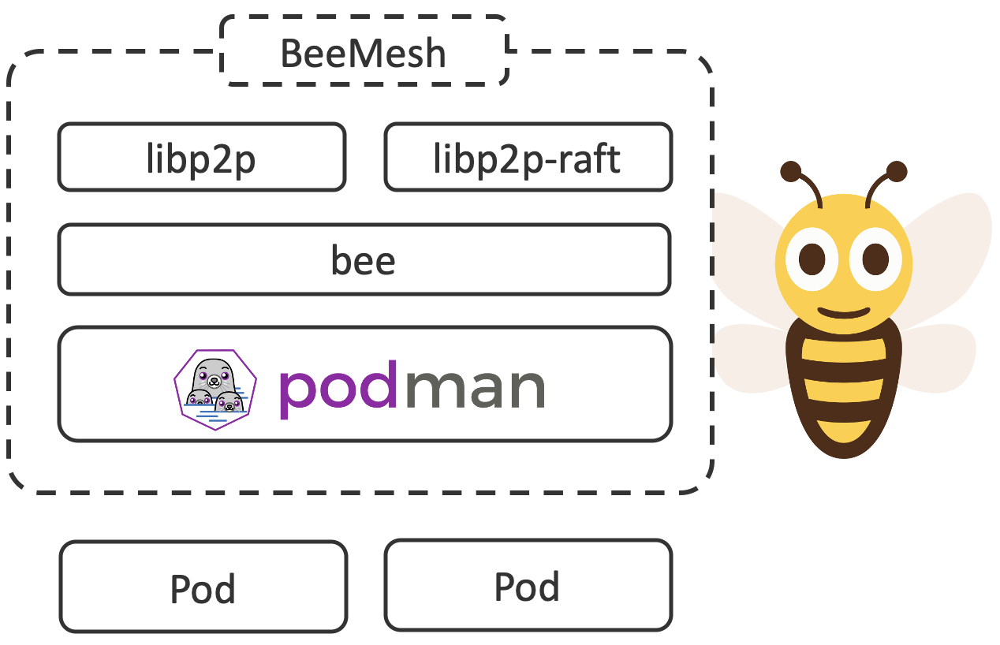

# BeeMesh

## Vision
Imagine a world where everyone understands everyone else. Work would be continuously organized based on ability, capacity, and trustworthiness. Work can be loosely distributed to a reasonable extent to meet needs. When statefulness is required, ephemeral consensus just lives alongside the work. Would such a computational model scale globally?

## Problem Statement
The reality is that trustworthiness is determined manually. Then consensus is determined regardless of whether the work requires it. If the consensus is compromised, then all work is also affected.

Kubernetes aggregates infrastructure as a single uniform computer. Unity is achieved by a cluster algorithm. The continuous allocation of workload is done according to this set of rules and the runtime is continuously reconciliated. Such uniform computers aka clusters, usually follow the rules of perimeter security.

Kubernetes follows a scale-out approach when it comes to increase the available resources for workloads. The infrastructure can also be requested larger eg. scaled-up for a more advantageous utilization rate.

Kubernetes connectivity can be extended with basic network virtualization in different forms. Several clusters are disjoint and therefore require further extensions such as service meshes with replicated control planes or cluster federation as needed. Traditional services are excluded and must be considered separately. Despite the overall intention, this infrastructure-focused connectivity does not meet today's requirements for a fine-grained, resilient software design.

The overall design decisions and ranking made for a) clustering and b) connectivity, although individually exemplary and modularly implemented, lead to limitations in terms of scaling and connectivity.

## Architecture

BeeMesh prioritises connectivity and dissolves clustering in its present form. Removing the infrastructure clustering eliminates the scaling limits. This favours today's security concepts, life cycle and reduces the administrative efforts.

A Kademlia based DHT peer to peer mesh has been alive since 2005. Measurements from the year 2013 show a volume of 10 to 25 million subscribers with a daily volatility of around 10 million. The peer to peer mesh naturally prefers participiants beeing alive for longer over newer entrants. 

Priorisation the peer to peer mesh over infrastructure state management enables a massive scale-out of stateless based long-lasting processing and functions. Stateless workload is notified by a [publish/subscribe](https://docs.libp2p.io/concepts/publish-subscribe/) pattern where peers congregate around topics they are interested in. State management is solely required by stateful workload. As such, the problem context shrinks to a transient state machine exactly matching the workload lifecycle.

## Policies
Peer to peer mesh policies allows you to make long-lasting processing or functions act as a resilient system through controlling how they communicate with each other as well as with external services. As such, a [general-purpose policy engine](https://www.openpolicyagent.org) that enables unified, context-aware policy enforcement across the entire mesh should be taken in to consideration.

## API
A Kubernetes compliant API is encouraged so that workloads can be shifted smoothly.
