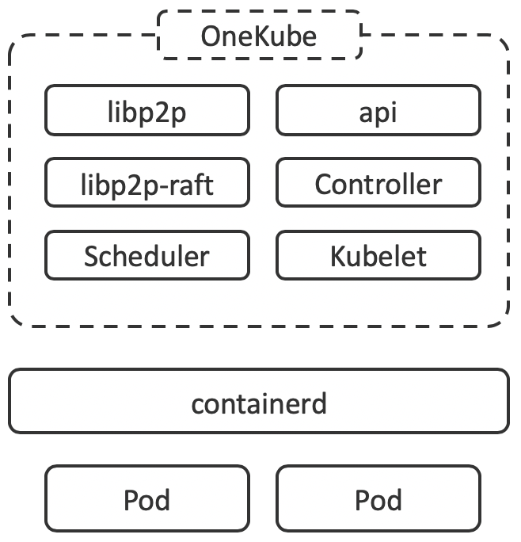

# One
Zero trust peer-to-peer global scale computing for long lasting processes and functions.

## Idea
The current implementations are derived from data center architectures and pile up complexity. The idea is questioning the basic assumptions and cutting off the obsolete like heavy networking.

Decoupling the node coordination from the clustering offers a major advantage in scaling and continuous lifecycle. 

Abstraction | Approach | Alternative
--- | --- | ---
Clustering   | Supervised Consensus | P2P 
Scheduling | Relying on Cluster | Ad-hoc Consensus as required by Workload Specs
Connectivity | Network based | Connection based

## Package
One comes as single binary. Just deploy to join the P2P network to participate. 
{:height="300px"}

## API
Must be K8s compliant so that everybody can move on.

## Building Blocks
* P2P: [https://libp2p.io/](https://libp2p.io/)
* Workload Clustering: [https://github.com/libp2p/go-libp2p-raft](https://github.com/libp2p/go-libp2p-raft)
* Container runtime: [https://containerd.io/](https://containerd.io/)
* Kubernetes: [https://kubernetes.io/](https://kubernetes.io/)
* Lightweight Kubernetes: [https://k3s.io/](https://k3s.io/)
* Example P2P Database: https://github.com/orbitdb

## Prototype
WIP
