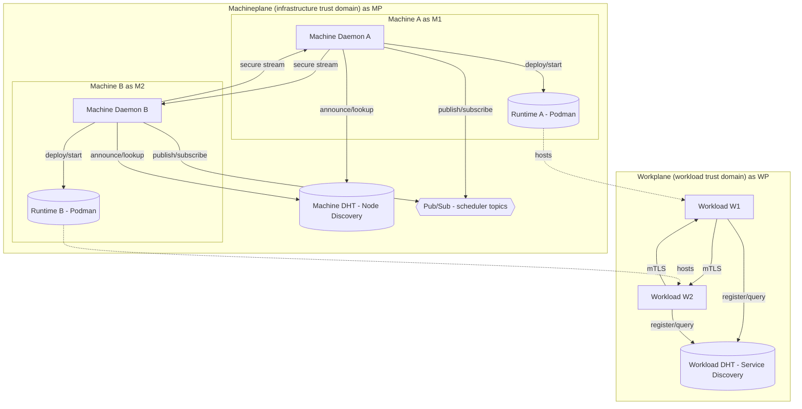

# **Beemesh: Global Mesh Computing**

> **Beemesh** is a scale-out fabric that turns any device - cloud, on-prem, edge, or IoT - into an interchangeable compute resource.
> It scales out by eliminating the centralized control plane, enabling **secure, self-healing workloads** across highly dynamic environments.

-----

Beemesh starts from the assumption that everything is transient: identity, state, and trust. The system is therefore designed for motion, not static infrastructure. Persistence is treated as a risk, not a default - nothing is stored unless explicitly required.

## **1. Introduction**

Clouds and modern systems like Kubernetes are powerful but **inherently limited by centralization**. As these systems grow:

  * Control planes become **scaling bottlenecks**.
  * Consensus overhead increases.
  * Infrastructure failures ripple through workloads and disrupt our digital landscape.

Beemesh rethinks scale-out from the ground up:

  * **No global consensus** - fully scale-out fabric choreography.
  * **Consumer-aligned consistency** - each application carries its own state management.
  * **Scale out** - limited only by network capacity.

-----

## **2. Why Beemesh**

| Problem in Legacy Systems                                                | Beemesh Solution                                                                                                                                           |
| ------------------------------------------------------------------------ | ---------------------------------------------------------------------------------------------------------------------------------------------------------- |
| Scaling beyond thousands of nodes is hard due to control plane overhead. | **Fully decentralized choreography** instead of central orchestration.                                                                                     |
| Machine failures destabilize the control plane.                          | Machines are **fungible, disposable resources**; state lives **inside workloads**.                                                                         |
| High operational complexity (etcd, API servers, Raft quorums).           | **Single lightweight daemon** (50–80 MiB RAM).                                                                                                             |
| Weak identity and trust at scale.                                        | **Separate identities for machines and workloads**, with mutually authenticated streams.                                                                   |
| Vendor lock-in to specific clouds or infra.                              | **Infrastructure-agnostic**, runs on anything.                                                                                                             |
| Day-2 toil for upgrades/patching of control planes.                      | **Decoupled, autonomous Machineplane** → **rebuild > repair**, near-zero toil **as long as a bootstrap source (manifests/images or surviving workloads) exists**. |

-----

## **3. Core Concept**

### **3.1 Separation of Concerns**

CAP trade-offs are expressed as **A/P** (Availability + Partition Tolerance) and **C/P** (Consistency + Partition Tolerance).

| Concern       | Purpose                                                                                                                                                                                                  | CAP Trade-off                                  |
| ------------- | -------------------------------------------------------------------------------------------------------------------------------------------------------------------------------------------------------- | ---------------------------------------------- |
| **Machine**   | Node discovery and ephemeral task negotiations; stores nothing. Machines are loosely coupled.                                                                                                            | **A/P** - Availability and Partition Tolerance |
| **Workload**  | Service discovery between workloads; maintains workload state and connectivity information. Workloads are loosely coupled to each other but tightly coherent internally, whether stateless or stateful. | **C/P** - Consistency and Partition Tolerance  |

> **Key benefit:** Machine failures do **not** pollute the workload. Each concern is isolated and optimized for its purpose, ensuring security, scalability, and reliability by design. This separation eliminates cross-cutting concerns and allows **each plane to optimize independently**. Scoping each plane to its domain prevents the monolithic anti-patterns that control-plane-centric platforms preserve.

-----

### **3.2 Consumer-Scoped Consistency**

Traditional cloud or orchestration systems stitch **infrastructure to clusters** and make the platform expensive and static, tying up a lot of operational resources by design.

**Beemesh flips the model:**

  * **Infrastructure is stateless**, ephemeral, and disposable by design.
  * Each **stateful workload carries its own consensus** (for example, a database).

> Machine failures never corrupt workloads, and the architecture enables scale-out to **thousands of nodes**.  
> Additionally, operational effort is reduced to near zero.

-----

### **3.3 Security Model**

Beemesh assigns transient and **separate cryptographic identities** to machines and workloads, and all communication in Beemesh is **mutually authenticated** and **end-to-end encrypted** using mutually authenticated, encrypted streams by design:

| Entity       | Identity Details                                                                                                                                                                                                                                |
| ------------ | ----------------------------------------------------------------------------------------------------------------------------------------------------------------------------------------------------------------------------------------------- |
| **Machine**  | Each machine has a **unique cryptographic identity** generated at initialization, backed by a public/private key pair, and used for node discovery, scheduling, and secure, mutually authenticated, encrypted machine-to-machine communication. |
| **Workload** | Each workload has a **unique cryptographic identity**, backed by a separate public/private key pair, and used only for service discovery and secure, mutually authenticated, encrypted workload-to-workload communication.                      |

  * This separation ensures **complete isolation of trust boundaries** between infrastructure and workloads, implementing zero trust at the core by design.
  * Machine and workload communication **never share credentials**.
  * Even if a machine is compromised, workloads remain isolated and protected.

-----

## **4. How Beemesh Compares**

| System      | Control Plane                   | Scaling Limit                | State Model                         | Notes                                       |
| ----------- | ------------------------------- | ---------------------------- | ----------------------------------- | ------------------------------------------- |
| Kubernetes  | Centralized (etcd + API server) | ~5,000 nodes / 150,000 pods  | Strong consistency cluster-wide     | Rich ecosystem but control-plane limited    |
| Nomad       | Centralized Raft quorum         | Thousands of nodes           | Strong consistency global scheduler | Lighter than K8s but still infra-bound      |
| Swarm       | Raft manager nodes              | ~1,000 nodes                 | Strong consistency cluster-wide     | Simple but infra-coupled                    |
| **Beemesh** | **None - scale-out fabric**     | **Tens of thousands+**       | **Consistency scoped to workload**  | Scale-out; only stateful workloads run Raft |

-----

## **5. Architecture**

### **5.1 High-Level Diagram**

---

### **5.2 Machineplane**

The **Machineplane** manages infrastructure resources and scheduling, with **no persistent state**. It is **disposable, fully decoupled, and autonomous** – rebuild at will **as long as you have some bootstrap source (for example, registries, manifests, or surviving workloads) to repopulate the fabric**.

#### **Responsibilities (explicit)**

* Node discovery via **Machine DHT**.
* Decentralized workload scheduling using ephemeral task negotiations.
* Fabric-level coordination through secure, mutually authenticated streams.
* Resource offering and bidding, capability advertisement, and local policy enforcement.
* Lifecycle hooks to start and stop workloads via the runtime (for example, **Podman**).

> **Operational impact:** no etcd, no API servers, no manager quorum, no backups - **near-zero operational toll.**

---

### **5.3 Ephemeral Scheduling Process**

Traditional schedulers maintain global fabric state and enforce consensus (Raft, etcd), creating bottlenecks.

Beemesh uses **ephemeral scheduling**: **tasks are never persisted**, and scheduling happens dynamically across the scale-out fabric. The Machineplane provides **at-least-once** scheduling semantics and is **duplicate-tolerant** by design.

#### **Step-by-Step Flow**

1. **Task Publication**

   * A new workload task is published on the `scheduler-tasks` Pub/Sub topic.
   * **Task payload includes:** resource requirements (CPU, memory, and so on), priority and QoS hints, and a **workload manifest reference**.

2. **Local Resource Evaluation**

   * Each node listens to the task topic and evaluates current resource availability and local policies (affinity rules, hardware constraints).
   * Nodes that **do not** satisfy the requirements or policies **do not bid**; they simply drop the Task after local evaluation.

3. **Bidding Phase**

   * Eligible nodes **submit bids** to the `scheduler-proposals` topic.
   * **Bids include:** node identity (Machine Peer ID) and **scoring metrics** (resource fit, network locality, capabilities).

4. **Selection Window**

   * A short window (for example, **100–500 ms**) allows multiple bids to arrive.
   * Nodes independently select the **best bid** based on scoring rules.

5. **Workload Deployment**

   * The winning node deploys the workload using **Podman**.
   * Deployment is confirmed via a follow-up Pub/Sub event.

#### **Advantages of Ephemeral Scheduling**

| Advantage                      | Why It Matters                                                                                          |
| ------------------------------ | ------------------------------------------------------------------------------------------------------- |
| **No single point of failure** | No central scheduler to crash or be partitioned.                                                        |
| **Low coordination overhead**  | Tasks are transient and do not require consensus.                                                       |
| **Partition tolerance**        | Nodes continue to schedule independently during network splits.                                         |
| **High throughput**            | Scales naturally with node count.                                                                       |
| **Thundering herd mitigation** | Only nodes that match placement and resource criteria bid, so reply volume stays bounded even at scale. |

**Duplicate tolerance**

The Machineplane is **duplicate-tolerant**. In races or partitions, multiple nodes **may** deploy the same workload. This is safe by design:

* Both stateless and stateful workloads are **self-contained**.
* The **replica count is always interpreted as “at least”** at the Machineplane.
* The Workplane/workload logic (leader election, idempotency, quorum writes) is responsible for enforcing correct behavior.
* It therefore does not matter if one or a few extra pods are scheduled transiently.

---

### **5.4 Machine-to-Machine Security**

* Each machine verifies scheduling message authenticity using **Machine Peer IDs**.
* All communications are encrypted and mutually authenticated using secure transport protocols.
* Rogue nodes cannot influence scheduling without a valid cryptographic identity.

---

### **5.5 Workplane**

The **Workplane** runs inside every Pod.

| Function              | Description                                                                                                                                                                                                       |
| --------------------- | ----------------------------------------------------------------------------------------------------------------------------------------------------------------------------------------------------------------- |
| **Self-Healing**      | Monitors desired replica counts and autonomously spawns replacements using local manifest data. Replica counts are treated as **“at least”** targets; the Machineplane may temporarily run extra replicas safely. |
| **Service Discovery** | Registers workloads in the **Workload DHT** for peer lookup and routing.                                                                                                                                          |
| **Secure Networking** | Pod-to-pod traffic flows through mutually authenticated, encrypted streams.                                                                                                                                       |
| **Manifest Storage**  | **Stores manifests locally for offline recovery** during partitions; enables autonomous respawn even if isolated.                                                                                                 |

**Workload-to-Workload Security**

* Each Pod uses a **unique Workload Peer ID**.
* Secure communication is **independent** of machine identities (separate trust domains).
* Prevents cross-plane privilege escalation.

---

## **6. Use Cases**

| Scenario                     | Why Beemesh Works                                                             |
| ---------------------------- | ----------------------------------------------------------------------------- |
| **Edge & IoT Networks**      | Operates in unreliable, partitioned networks with minimal resources.          |
| **Multicloud Microservices** | One service mesh across on-prem + Azure + AWS + GCP - no vendor lock-in.      |
| **Global Analytics/Batch**   | Elastic bursts across providers; ephemeral scheduling matches queue spikes.   |
| **Smart Cities / Telco**     | Millions of devices with frequent churn; the Machineplane is throwaway.       |
| **Enterprise Databases**     | State lives with the workload’s own quorum; infra failures do not corrupt it. |
| **Air-Gapped IT/OT**         | Full functionality inside isolated networks; optional selective sync.         |
| **Enterprise Workloads**     | Strong, consistent, reliable on-prem and multicloud behaviors by design.      |

---

## **7. Summary**

Beemesh represents a **paradigm shift** in orchestration:

* Eliminates centralized control planes and scaling bottlenecks.
* Uses **ephemeral, decentralized scheduling** for effectively unparalleled scalability.
* Provides **strict isolation** between infrastructure and workloads.
* Ensures **all communications are mutually authenticated and encrypted**.
* Scales to **tens of thousands of nodes**, ideal for edge, IoT, cloud, **multicloud**, and **air-gapped** environments.
* A **disposable, fully decoupled Machineplane** enables autonomous, low-toil operations.
* **Does not yet solve the “bootstrap paradox”**: if the Machineplane and all workloads are lost simultaneously, an external bootstrap mechanism (installers, registries, GitOps) is still required to rebuild the fabric.

> **Beemesh is not just another orchestration system - it is a secure, scale-out choreography fabric for the future of global computing.**

---

## **8. Comparison Matrix**

> *Note on "Mutually Authenticated Streams": legacy systems may add this via optional plugins or sidecars, but it is **not** default fabric behavior.*

| Feature                                 | Kubernetes        | Nomad             | **Beemesh**                 |
| --------------------------------------- | ----------------- | ----------------- | --------------------------- |
| Central Control Plane                   | Yes               | Yes               | **No**                      |
| Separate Machine & Workload DHTs        | No                | No                | **Yes**                     |
| Unique Peer IDs per Machine             | No                | No                | **Yes**                     |
| Unique Peer IDs per Workload            | No                | No                | **Yes**                     |
| Mutually Authenticated Machine Streams  | Optional (addons) | Optional (addons) | **Yes (default)**           |
| Mutually Authenticated Workload Streams | Optional (addons) | Optional (addons) | **Yes (default)**           |
| Global Consensus Required               | Yes               | Yes               | **No**                      |
| Scalability Ceiling                     | ~5,000 nodes      | ~10,000 nodes     | **Tens of thousands+**      |
| IoT Suitability                         | Medium            | Medium            | **Excellent**               |
| Edge Suitability                        | Medium            | Medium            | **Excellent**               |
| Enterprise Suitability                  | Excellent         | Excellent         | **Excellent (+air-gapped)** |

---

## **9. Community & Support**

* **GitHub**: [github.com/beemesh/beemesh](https://github.com/beemesh/beemesh)
* **Documentation**: [docs.beemesh.io](https://docs.beemesh.io)
* **License**: Apache 2.0

---

## **10. Specifications**

For full normative details, see:

* **Machineplane Spec**: [`machineplane-spec.md`](./machineplane-spec.md)
  Node discovery, ephemeral scheduling, deployment, security, failure handling, and observability.

* **Workplane Spec**: [`workplane-spec.md`](./workplane-spec.md)
  Per-workload service discovery, workload identity, secure workload-to-workload connectivity, self-healing, and consistency gating.