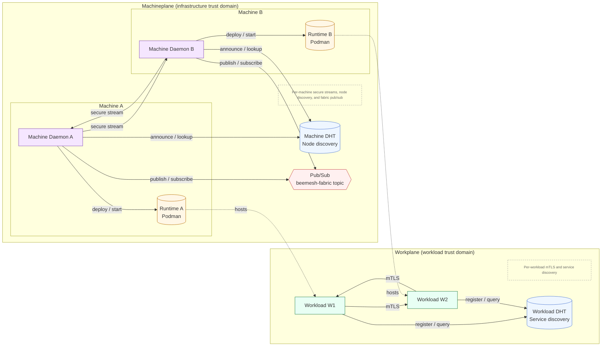

# **Global Mesh Computing**

K8s API — **without** the hassle.

✅ No masters, no etcd, no Raft quorum, no API servers to babysit  
✅ Machines are disposable; **state lives with the workload**  
✅ End-to-end mTLS between machines *and* workloads by default  
✅ Designed for **tens of thousands of nodes**, partitions, and churn
  
> Just run, scale, enjoy!
> 
> **Beemesh** is a scale-out fabric that turns any device—cloud, on-prem, edge, or IoT—into an interchangeable compute resource.
> It scales out by eliminating the centralized control plane, enabling **secure, self-healing workloads** across highly dynamic environments.

[](https://www.rust-lang.org)
[](LICENSE)
[](https://libp2p.io)

-----

## **Table of Contents**

1. [Introduction](#1-introduction)
2. [Why Beemesh](#2-why-beemesh)
3. [Core Concept](#3-core-concept)
4. [How Beemesh Compares](#4-how-beemesh-compares)
5. [Architecture](#5-architecture)
6. [Quick Start](#6-quick-start)
7. [Use Cases](#7-use-cases)
8. [Summary](#8-summary)
9. [Comparison Matrix](#9-comparison-matrix)
10. [Specifications](#10-specifications)
11. [Community & Support](#11-community--support)

-----

## **1. Introduction**

Clouds and modern systems like Kubernetes are powerful but **inherently limited by centralization**. As these systems grow:

  * Control planes become **scaling bottlenecks**.
  * Consensus overhead increases.
  * Infrastructure failures ripple through workloads and disrupt our digital landscape.

Beemesh rethinks scale-out from the ground up:

  * **No global consensus**—fully scale-out fabric choreography.
  * **Consumer-aligned consistency**—each application carries its own state management.
  * **Scale out**—limited only by network capacity.

Beemesh starts from the assumption that everything is transient: identity, state, and trust. The system is therefore designed from the ground up for motion. Built-in self-healing, intelligent workload clustering, and mutual authentication with end-to-end encryption by design.

-----

## **2. Why Beemesh**

| Problem in Legacy Systems                                                | Beemesh Solution                                                                                                                                           |
| ------------------------------------------------------------------------ | ---------------------------------------------------------------------------------------------------------------------------------------------------------- |
| Scaling beyond thousands of nodes is hard due to control plane overhead. | **Fully decentralized choreography** instead of central orchestration.                                                                                     |
| Machine failures destabilize the control plane.                          | Machines are **fungible, disposable resources**; state lives **inside workloads**.                                                                         |
| High operational complexity (etcd, API servers, Raft quorums).           | **Single lightweight daemon** (50–80 MiB RAM).                                                                                                             |
| Weak identity and trust at scale.                                        | **Separate identities for machines and workloads**, with mutually authenticated streams.                                                                   |
| Vendor lock-in to specific clouds or infra.                              | **Infrastructure-agnostic**, runs on anything.                                                                                                             |
| Day-2 toil for upgrades/patching of control planes.                      | **Decoupled, autonomous Machineplane** → **rebuild > repair**, near-zero toil **as long as a bootstrap source (manifests/images or surviving workloads) exists**. |

-----

## **3. Core Concept**

### **3.1 Separation of Concerns**

CAP trade-offs are expressed as **A/P** (Availability + Partition Tolerance) and **C/P** (Consistency + Partition Tolerance).

| Concern       | Purpose                                                                                                                                                                                                  | CAP Trade-off                                  |
| ------------- | -------------------------------------------------------------------------------------------------------------------------------------------------------------------------------------------------------- | ---------------------------------------------- |
| **Machine**   | Node discovery and ephemeral tender negotiations; stores nothing. Machines are loosely coupled.                                                                                                            | **A/P** - Availability and Partition Tolerance |
| **Workload**  | Service discovery between workloads; maintains workload state and connectivity information. Workloads are loosely coupled to each other but tightly coherent internally, whether stateless or stateful. | **C/P** - Consistency and Partition Tolerance  |

> **Key benefit:** Machine failures do **not** pollute the workload. Each concern is isolated and optimized for its purpose, ensuring security, scalability, and reliability by design. This separation eliminates cross-cutting concerns and allows **each plane to optimize independently**. Scoping each plane to its domain prevents the monolithic anti-patterns that control-plane-centric platforms preserve.

-----

### **3.2 Consumer-Scoped Consistency**

Traditional cloud or orchestration systems stitch **infrastructure to clusters** and make the platform expensive and static, tying up a lot of operational resources by design.

**Beemesh flips the model:**

  * **Infrastructure is stateless**, ephemeral, and disposable by design.
  * Each **stateful workload carries its own consensus** (e.g., Raft for databases).

> Machine failures never corrupt workloads, and the architecture enables scale-out to **thousands of nodes**.  
> Additionally, operational effort is reduced to near zero.

-----

### **3.3 Security Model**

Beemesh assigns transient and **separate cryptographic identities** to machines and workloads, and all communication in Beemesh is **mutually authenticated** and **end-to-end encrypted** using mutually authenticated, encrypted streams by design:

| Entity       | Identity Details                                                                                                                                                                                                                                |
| ------------ | ----------------------------------------------------------------------------------------------------------------------------------------------------------------------------------------------------------------------------------------------- |
| **Machine**  | Each machine has a **unique cryptographic identity** generated at initialization, backed by an Ed25519 key pair, and used for node discovery, scheduling, and secure, mutually authenticated, encrypted machine-to-machine communication. |
| **Workload** | Each workload has a **unique cryptographic identity**, backed by a separate Ed25519 key pair, and used only for service discovery and secure, mutually authenticated, encrypted workload-to-workload communication.                      |

  * This separation ensures **complete isolation of trust boundaries** between infrastructure and workloads, implementing zero trust at the core by design.
  * Machine and workload communication **never share credentials**.
  * Even if a machine is compromised, workloads remain isolated and protected.

-----

## **4. How Beemesh Compares**

| System      | Control Plane                   | Scaling Limit                | State Model                         | Notes                                       |
| ----------- | ------------------------------- | ---------------------------- | ----------------------------------- | ------------------------------------------- |
| Kubernetes  | Centralized (etcd + API server) | ~5,000 nodes / 150,000 pods  | Strong consistency cluster-wide     | Rich ecosystem but control-plane limited    |
| Nomad       | Centralized Raft quorum         | Thousands of nodes           | Strong consistency global scheduler | Lighter than K8s but still infra-bound      |
| Swarm       | Raft manager nodes              | ~1,000 nodes                 | Strong consistency cluster-wide     | Simple but infra-coupled                    |
| **Beemesh** | **None—scale-out fabric**       | **Tens of thousands+**       | **Consistency scoped to workload**  | Scale-out; only stateful workloads run Raft |

-----

## **5. Architecture**

### **5.1 High-Level Diagram**


```mermaid
flowchart LR
  %% ============================================
  %% Styles
  %% ============================================
  classDef dht        fill:#EEF6FF,stroke:#4975D0,stroke-width:1px;
  classDef workload   fill:#E8FFF4,stroke:#1D7A46,stroke-width:1px;
  classDef runtime    fill:#FFF7E6,stroke:#B76B00,stroke-width:1px;
  classDef daemon     fill:#F5E6FF,stroke:#7B3FB3,stroke-width:1px;
  classDef bus        fill:#FFF0F0,stroke:#C43D3D,stroke-width:1px;
  classDef caption    fill:none,stroke-dasharray:3 3,stroke:#999,color:#666,font-size:11px;

  %% ============================================
  %% Workplane (per-workload trust domain)
  %% ============================================
  subgraph WP["Workplane (workload trust domain)"]
    direction TB

    WP_CAP["Per-workload mTLS and service discovery"]:::caption

    WDHT[(Workload DHT<br/>Service discovery)]:::dht
    W1[Workload W1]:::workload
    W2[Workload W2]:::workload

    %% Workload-to-workload mTLS
    W1 -->|mTLS| W2
    W2 -->|mTLS| W1

    %% Workload DHT for service discovery
    W1 -->|register / query| WDHT
    W2 -->|register / query| WDHT
  end

  %% ============================================
  %% Machineplane (infrastructure trust domain)
  %% ============================================
  subgraph MP["Machineplane (infrastructure trust domain)"]
    direction TB

    MP_CAP["Per-machine secure streams, node discovery, and fabric pub/sub"]:::caption

    MDHT[(Machine DHT<br/>Node discovery)]:::dht
    PS{{Pub/Sub<br/>beemesh-fabric topic}}:::bus

    %% ---------- Machine A ----------
    subgraph MA["Machine A"]
      direction TB
      D1[Machine Daemon A]:::daemon
      R1[(Runtime A<br/>Podman)]:::runtime
    end

    %% ---------- Machine B ----------
    subgraph MB["Machine B"]
      direction TB
      D2[Machine Daemon B]:::daemon
      R2[(Runtime B<br/>Podman)]:::runtime
    end

    %% Secure streams between daemons
    D1 -->|secure stream| D2
    D2 -->|secure stream| D1

    %% Machine DHT for node discovery
    D1 -->|announce / lookup| MDHT
    D2 -->|announce / lookup| MDHT

    %% Fabric pub/sub
    D1 -->|publish / subscribe| PS
    D2 -->|publish / subscribe| PS
  end

  %% ============================================
  %% Runtime–Workload relationship
  %% ============================================
  D1 -->|deploy / start| R1
  D2 -->|deploy / start| R2

  R1 -. hosts .-> W1
  R2 -. hosts .-> W2

```

---

### **5.2 Machineplane**

The **Machineplane** manages infrastructure resources and scheduling, with **no persistent state**. It is **disposable, fully decoupled, and autonomous**—rebuild at will **as long as you have some bootstrap source (e.g., registries, manifests, or surviving workloads) to repopulate the fabric**.

#### **Implementation**

The machineplane is implemented in Rust using libp2p for peer-to-peer networking:

| Module | Description |
|--------|-------------|
| `network/` | libp2p networking (Gossipsub + Kademlia DHT + Request-Response over QUIC) |
| `scheduler.rs` | Tender/Bid/Award scheduling logic with replay protection |
| `messages.rs` | Wire protocol message definitions (bincode serialization) |
| `signatures.rs` | Ed25519 cryptographic signing/verification |
| `runtimes/` | Container runtime adapters (Podman) |
| `api/` | REST API with Kubernetes compatibility |

#### **Responsibilities**

* Node discovery via **Machine DHT** (Kademlia).
* Decentralized workload scheduling using ephemeral tender negotiations.
* Fabric-level coordination through secure, mutually authenticated streams.
* Resource offering and bidding, capability advertisement, and local policy enforcement.
* Lifecycle hooks to start and stop workloads via the runtime (**Podman**).

> **Operational impact:** no etcd, no API servers, no manager quorum, no backups—**near-zero operational toll.**

---

### **5.3 Ephemeral Scheduling Process**

Traditional schedulers maintain global fabric state and enforce consensus (Raft, etcd), creating bottlenecks. Beemesh uses **ephemeral scheduling**: **tenders are never persisted**, and scheduling happens dynamically across the scale-out fabric. 

#### **Advantages of Ephemeral Scheduling**

| Advantage                      | Why It Matters                                                                                          |
| ------------------------------ | ------------------------------------------------------------------------------------------------------- |
| **No single point of failure** | No central scheduler to crash or be partitioned.                                                        |
| **Low coordination overhead**  | Tenders are transient and do not require consensus.                                                       |
| **Partition tolerance**        | Nodes continue to schedule independently during network splits.                                         |
| **High throughput**            | Scales naturally with node count.                                                                       |
| **Thundering herd mitigation** | Only nodes that match placement and resource criteria bid, so reply volume stays bounded even at scale. |

---

### **5.4 Machine-to-Machine Security**

* Each machine verifies scheduling message authenticity using **Ed25519 signatures**.
* All communications are encrypted and mutually authenticated using **QUIC transport with TLS 1.3**.
* Replay protection via `(timestamp, nonce)` tuples with ±30 second clock skew tolerance.
* Rogue nodes cannot influence scheduling without a valid cryptographic identity.

---

### **5.5 Workplane**

The **Workplane** runs as a sidecar agent inside every Pod, providing per-workload service discovery and self-healing.

#### **Implementation**

| Module | Description |
|--------|-------------|
| `agent.rs` | Main agent orchestrator |
| `network.rs` | libp2p networking (Kademlia DHT + Request-Response RPC over QUIC) |
| `discovery.rs` | In-memory WDHT cache with TTL-based expiration and conflict resolution |
| `raft.rs` | Simplified Raft for leader election (stateful workloads only) |
| `selfheal.rs` | Replica management and health probing |
| `rpc.rs` | RPC request/response types |
| `config.rs` | Environment-based configuration |

#### **Functions**

| Function              | Description                                                                                                                                                                                                       |
| --------------------- | ----------------------------------------------------------------------------------------------------------------------------------------------------------------------------------------------------------------- |
| **Self-Healing**      | Monitors desired replica counts and autonomously spawns replacements using local manifest data. Replica counts are treated as **"at least"** targets; the Machineplane may temporarily run extra replicas safely. |
| **Service Discovery** | Registers workloads in the **Workload DHT** for peer lookup and routing via `ServiceRecord` entries with TTL.                                                                                                    |
| **Secure Networking** | Pod-to-pod traffic flows through mutually authenticated, encrypted streams using libp2p QUIC.                                                                                                                    |
| **Leader Election**   | For **stateful workloads** (StatefulSets), Raft consensus ensures leader-only writes and minority partition refusal.                                                                                              |

#### **Workload-to-Workload Security**

* Each Pod uses a **unique Workload Peer ID** (Ed25519).
* Secure communication is **independent** of machine identities (separate trust domains).
* Prevents cross-plane privilege escalation.

---

## **6. Quick Start**

### **Prerequisites**

* Rust 1.75+ (`rustup update stable`)
* Podman 4.x+ (for container runtime)
* Linux or macOS

### **Build**

```bash
# Clone the repository
git clone https://github.com/beemesh/beemesh.git
cd beemesh

# Build all components
cargo build --release
```

### **Run the Machineplane Daemon**

```bash
# Start a single node (auto-detects Podman socket)
./target/release/machineplane

# Start with explicit configuration
./target/release/machineplane \
  --rest-api-port 3000 \
  --libp2p-quic-port 4001 \
  --bootstrap-peer "/ip4/192.168.1.10/udp/4001/quic-v1/p2p/<peer_id>"
```

#### **Machineplane CLI Options**

| Option | Default | Description |
|--------|---------|-------------|
| `--rest-api-host` | `0.0.0.0` | Host address for REST API |
| `--rest-api-port` | `3000` | Port for REST API |
| `--podman-socket` | (auto-detect) | Podman socket URL |
| `--libp2p-quic-port` | `0` (auto) | Port for libp2p QUIC transport |
| `--libp2p-host` | `0.0.0.0` | Host for libp2p listeners |
| `--bootstrap-peer` | (none) | Bootstrap peer multiaddr (repeatable) |
| `--dht-refresh-interval-secs` | `60` | DHT presence refresh interval |
| `--ephemeral-keys` | `false` | Use ephemeral keys (no disk persistence) |

### **Run the Workplane Agent**

```bash
# Inside a pod/container
./target/release/workplane \
  --namespace default \
  --workload nginx \
  --pod nginx-0 \
  --workload-kind Deployment \
  --replicas 3 \
  --liveness-url http://127.0.0.1:8080/health \
  --readiness-url http://127.0.0.1:8080/ready \
  --privkey $BEE_PRIVATE_KEY_B64
```

#### **Workplane Environment Variables**

| Variable | Description | Default |
|----------|-------------|---------|
| `BEE_NAMESPACE` | Kubernetes namespace | `default` |
| `BEE_WORKLOAD_NAME` | Workload name | Required |
| `BEE_POD_NAME` | Pod name | Required |
| `BEE_WORKLOAD_KIND` | `Deployment` or `StatefulSet` | `Deployment` |
| `BEE_REPLICAS` | Desired replica count | `1` |
| `BEE_LIVENESS_URL` | HTTP liveness probe URL | None |
| `BEE_READINESS_URL` | HTTP readiness probe URL | None |
| `BEE_MACHINE_API` | Machineplane API URL | `http://localhost:8080` |
| `BEE_PRIVATE_KEY_B64` | Base64-encoded Ed25519 private key | Required |
| `BEE_DHT_TTL_SECS` | WDHT record TTL | `15` |
| `BEE_HEALTH_INTERVAL_SECS` | Health check interval | `10` |
| `BEE_REPLICA_CHECK_INTERVAL_SECS` | Reconciliation interval | `30` |

### **Deploy a Workload (kubectl-compatible)**

```bash
# Create a deployment
curl -X POST http://localhost:3000/apis/apps/v1/namespaces/default/deployments \
  -H "Content-Type: application/yaml" \
  -d @nginx-deployment.yaml

# List deployments
curl http://localhost:3000/apis/apps/v1/namespaces/default/deployments

# List pods
curl http://localhost:3000/api/v1/namespaces/default/pods

# Delete a deployment
curl -X DELETE http://localhost:3000/apis/apps/v1/namespaces/default/deployments/nginx
```

---

## **7. Use Cases**

| Scenario                     | Why Beemesh Works                                                             |
| ---------------------------- | ----------------------------------------------------------------------------- |
| **Edge & IoT Networks**      | Operates in unreliable, partitioned networks with minimal resources.          |
| **Multicloud Microservices** | One service mesh across on-prem + Azure + AWS + GCP—no vendor lock-in.        |
| **Global Analytics/Batch**   | Elastic bursts across providers; ephemeral scheduling matches queue spikes.   |
| **Smart Cities / Telco**     | Millions of devices with frequent churn; the Machineplane is throwaway.       |
| **Enterprise Databases**     | State lives with the workload's own quorum; infra failures do not corrupt it. |
| **Air-Gapped IT/OT**         | Full functionality inside isolated networks; optional selective sync.         |
| **Enterprise Workloads**     | Strong, consistent, reliable on-prem and multicloud behaviors by design.      |

---

## **8. Summary**

Beemesh represents a **paradigm shift** in orchestration:

* Eliminates centralized control planes and scaling bottlenecks.
* Uses **ephemeral, decentralized scheduling** for effectively unparalleled scalability.
* Provides **strict isolation** between infrastructure and workloads.
* Ensures **all communications are mutually authenticated and encrypted**.
* Scales to **tens of thousands of nodes**, ideal for edge, IoT, cloud, **multicloud**, and **air-gapped** environments.
* A **disposable, fully decoupled Machineplane** enables autonomous, low-toil operations.

> **Beemesh is not just another orchestration system—it is a secure, scale-out choreography fabric for the future of global computing.**

---

## **9. Comparison Matrix**

> *Note on "Mutually Authenticated Streams": legacy systems may add this via optional plugins or sidecars, but it is **not** default fabric behavior.*

| Feature                                 | Kubernetes        | Nomad             | **Beemesh**                 |
| --------------------------------------- | ----------------- | ----------------- | --------------------------- |
| Central Control Plane                   | Yes               | Yes               | **No**                      |
| Separate Machine & Workload DHTs        | No                | No                | **Yes**                     |
| Unique Peer IDs per Machine             | No                | No                | **Yes**                     |
| Unique Peer IDs per Workload            | No                | No                | **Yes**                     |
| Mutually Authenticated Machine Streams  | Optional (addons) | Optional (addons) | **Yes (default)**           |
| Mutually Authenticated Workload Streams | Optional (addons) | Optional (addons) | **Yes (default)**           |
| Global Consensus Required               | Yes               | Yes               | **No**                      |
| Scalability Ceiling                     | ~5,000 nodes      | ~10,000 nodes     | **Tens of thousands+**      |
| IoT Suitability                         | Medium            | Medium            | **Excellent**               |
| Edge Suitability                        | Medium            | Medium            | **Excellent**               |
| Enterprise Suitability                  | Excellent         | Excellent         | **Excellent (+air-gapped)** |

---

## **10. Specifications**

For full normative details, see:

* **Technical Specification**: [`technical-spec.md`](./technical-spec.md)  
  Comprehensive technical details including data structures, wire protocols, and API reference.

* **Machineplane Spec**: [`machineplane/machineplane-spec.md`](./machineplane/machineplane-spec.md)  
  Node discovery, ephemeral scheduling, deployment, security, failure handling, and observability.

* **Workplane Spec**: [`workplane/workplane-spec.md`](./workplane/workplane-spec.md)  
  Per-workload service discovery, workload identity, secure workload-to-workload connectivity, self-healing, and consistency gating.

### **Technology Stack**

| Component | Technology | Version |
|-----------|------------|---------|
| Language | Rust | 1.75+ |
| Networking | libp2p | 0.56 |
| Transport | QUIC | via libp2p |
| DHT | Kademlia | via libp2p |
| Pub/Sub | Gossipsub | via libp2p |
| Serialization | bincode + serde | 1.3 / 1.0 |
| Container Runtime | Podman | 4.x |
| REST Framework | axum | — |

---

## **11. Community & Support**

* **GitHub**: [github.com/beemesh/beemesh](https://github.com/beemesh/beemesh)
* **Documentation**: [docs.beemesh.io](https://docs.beemesh.io)
* **License**: Apache 2.0
