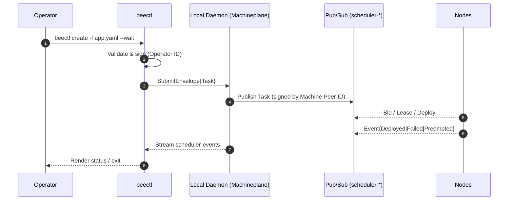
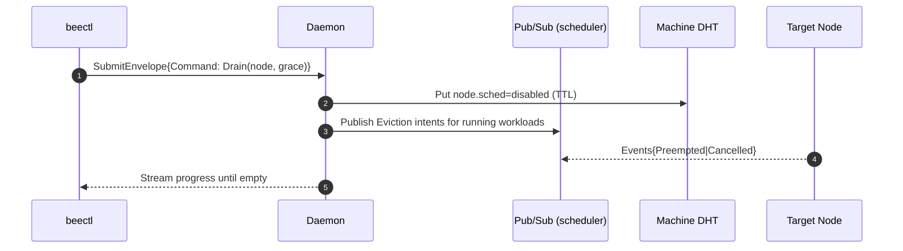
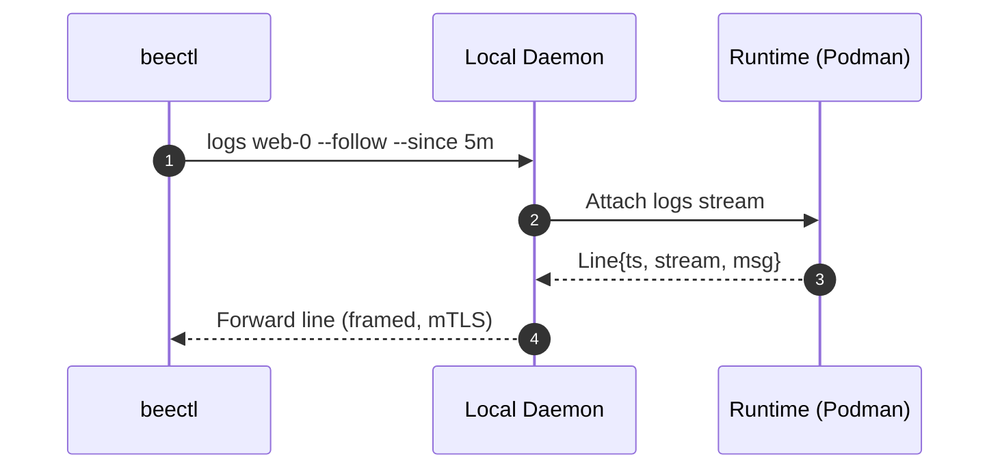

# beectl — Normative CLI Specification (v0.1)

> Scope: This document specifies the **beectl** command‑line interface for Beemesh. It defines command surface, I/O formats, transport, security, exit codes, and observable behavior. Normative terms follow **RFC 2119**. Gherkin scenarios are provided for key interactions.

---

## 1. Goals & Non‑Goals

### 1.1 Goals

* Provide a **thin, stateless** operator interface to the Machineplane.
* Submit **ephemeral intents** (create/cancel), observe **scheduler events**, inspect **machine peers**, and **proxy runtime I/O** (logs/port‑forward) **via the local daemon**.
* Maintain strong **operator provenance** (signed requests) and **mutual auth** end‑to‑end.

### 1.2 Non‑Goals (Machineplane‑only boundary)

* beectl **MUST NOT** read from or write to the **Workload DHT** directly.
* beectl **MUST NOT** hold or present **workload credentials**.
* beectl **MUST NOT** execute workload‑level consensus/membership operations.

---

## 2. Architecture & Security

### 2.1 Transport

* Default transport **MUST** be a **Unix domain socket** to the local Machineplane daemon at `~/.beemesh/daemon.sock`.
* `--remote <multiaddr>` **MAY** target a remote daemon via `libp2p` **Noise/TLS** mutual auth.

### 2.2 Identity & AuthZ

* beectl **MUST** use an **Operator ID** (Ed25519) stored in `~/.beemesh/keys` (0600 perms).
* Every mutating request **MUST** be signed; the daemon **MUST** verify and relay using its **Machine Peer ID**.
* Authorization **SHOULD** be enforced by daemon policy (allow/deny lists, org CA chains).

### 2.3 Data Flow (Machineplane‑only)



---

## 3. Command Surface (Machineplane‑Only)

```
beectl [--context CTX] [--namespace NS] [--remote MADDR] [--output table|json|yaml] [--quiet]
  create -f FILE [--labels k=v] [--set k=v] [--wait] [--timeout 60s] [--dry-run]
  delete pod NAME [--grace 30s] [--force]
  get pods [NAME...] [--watch] [--selector LABELSEL] [--since 10m]
  events [--since 1h] [--watch]
  logs POD[/CONTAINER] [--since 1h] [--follow] [--tail 100]
  peers --machine [--output ...]
  nodes [--watch] | drain NODE [--grace 60s] | cordon NODE | uncordon NODE
  config get-contexts | use-context NAME | set-context NAME [--remote ...] [--namespace ...]
  auth keygen [--name NAME] | show
  version [--short]
```

**Notes**

* `get pods` and `events` **MUST** source data **only** via the local daemon’s **scheduler‑events** and runtime views. There is **no direct WDHT access**.
* `peers` lists **Machine DHT** peers only.

---

## 4. Output & Exit Codes

* `--output/-o` **MUST** support `table` (default), `json`, `yaml`.
* Exit codes: `0` success; `1` generic; `2` validation; `3` auth; `4` timeout.

---

## 5. Wire Schemas (Normative)

### 5.1 SubmitEnvelope (all mutating requests)

```json
{
  "op_id": "op:alice",
  "op_sig": "ed25519:...",
  "ts": 1726646400123,
  "nonce": "base64-12B"
}
```

### 5.2 Task (published by daemon to scheduler‑tasks)

```json
{
  "task_id": "01JABCD...",
  "manifest_ref": "oci://registry/app:1.2.3#deployment.yaml",
  "reqs": {"cpu_m": 500, "mem_mb": 256},
  "qos": {"priority": 5, "preemptible": true},
  "affinity": {"include": ["region:eu"]},
  "ts": 1726646400123,
  "sig": "ed25519:daemon"
}
```

### 5.3 Cancel Command (daemon → scheduler)

```json
{
  "type": "Cancel",
  "workload_id": "orders-v1",
  "grace_ms": 30000,
  "ts": 1726646401123,
  "sig": "ed25519:daemon"
}
```

### 5.4 Events Stream (read‑only)

* Source: **scheduler-events** (Machineplane). The daemon **MAY** enrich with local runtime info (e.g., container exit code) but **MUST NOT** inject Workplane records.

---

## 6. Command Specifications (RFC 2119)

### 6.1 `create`

* **MUST** validate the manifest (K8s Deployment/StatefulSet compatible subset) and refuse ambiguous or missing fields.
* **MUST** sign and submit one **Task** via the daemon.
* `--labels`/`--set` **MUST** perform client‑side substitutions before signing.
* `--dry-run` **MUST** print the Task JSON and exit `0` without submission.
* `--wait` **SHOULD** stream **scheduler-events** until all targeted replicas report `Deployed` → `ReplicaReady` (as observed via the daemon’s runtime), or timeout.
* `--timeout` **MUST** bound `--wait` and return exit code **4** on expiry.

### 6.2 `delete pod <name>`

* **MUST** submit a **Cancel** with `grace_ms` derived from `--grace`.
* With `--force`, **MUST** set `grace_ms=0` and request immediate termination.
* **SHOULD** wait until the pod disappears from the daemon’s runtime index.

### 6.3 `get pods`

* **MUST** build status from **scheduler-events** + daemon runtime (container states), **without querying WDHT**.
* **MUST** display `NAME`, `READY`, `STATUS`, `AGE`, `NODE`, `WORKLOAD_ID`.
* `--watch` **SHOULD** stream updates.

### 6.4 `events`

* **MUST** show **only Machineplane scheduler-events** in chronological order.
* `--watch` **SHOULD** keep the stream open.

### 6.5 `logs`

* **MUST** proxy over a secure stream to the owning daemon/runtime.
* `--since`, `--tail`, `--follow` **MUST** be honored; default limits are implementation‑defined.
* Lines **MUST** be timestamped (RFC 3339) unless `--output raw`.

### 6.6 `peers --machine`

* **MUST** list Machine DHT peers with: `PEER_ID`, `ADDRS`, `SEEN`, `CAPS` (minimal).
* **MUST NOT** query or display Workplane peers.

### 6.7 `nodes`/`drain`/`cordon`/`uncordon`

* `nodes` **MUST** show node availability from Machine DHT and local daemon probes.
* `drain` **MUST** mark a node unschedulable (ephemeral MDHT flag) and request graceful eviction via scheduler intents.
* `cordon`/**uncordon** **MUST** toggle schedulability (ephemeral; TTL‑refreshed).

### 6.8 `config` & `auth`

* `config` commands **MUST** mutate only client‑side context.
* `auth keygen` **MUST** create a new Operator ID with 0600 permissions; `auth show` **MUST** print its fingerprint.

### 6.9 `version`

* **MUST** print client version and **SHOULD** display daemon/protocol versions.

---

## 7. UX Requirements

* Table output **MUST** adapt to terminal width and **MAY** truncate with ellipses.
* Color output **SHOULD** be enabled on TTY; `--no-color` disables.
* JSON/YAML schemas **MUST** be stable for scripting.

---

## 8. Additional Diagrams

### 8.1 Node Drain Flow



### 8.2 Logs Proxying



---

## 9. Validation & Errors

* Invalid flags/manifests **MUST** exit **2** with actionable diagnostics (line/column if available).
* Auth failures **MUST** exit **3** and suggest `beectl auth show`.
* Timeouts **MUST** exit **4** with partial progress summary.

---

## 10. Environment Variables

| Variable           | Purpose                  |
| ------------------ | ------------------------ |
| `BEECTL_CONTEXT`   | Default context name     |
| `BEECTL_NAMESPACE` | Default namespace        |
| `BEECTL_REMOTE`    | Default remote multiaddr |
| `BEECTL_OUTPUT`    | Default output format    |

---

## 11. Gherkin Scenarios (Executable‑style)

### Feature: Machineplane‑Only Boundary

```
Scenario: CLI refuses direct WDHT access
  Given beectl is installed
  When I run "beectl peers --workload"
  Then the command MUST fail with exit code 2
  And the error MUST state that Workplane access is not permitted
```

```
Scenario: CLI uses only scheduler-events for status
  Given a workload W is deploying
  When I run "beectl events --watch"
  Then the stream MUST include only Machineplane scheduler-events
```

### Feature: Secure Submission

```
Scenario: Create requires operator signature
  Given an active Operator ID
  When I run "beectl create -f app.yaml --dry-run -o json"
  Then the printed envelope MUST include op_id and op_sig
```

```
Scenario: Daemon relays with machine signature
  Given the local daemon is running
  When I run "beectl create -f app.yaml"
  Then the daemon MUST publish the Task signed by its Machine Peer ID
```

### Feature: Wait Semantics

```
Scenario: Wait completes when replicas are ready
  Given desired replicas = 3
  And three Deployed events are observed followed by runtime readiness
  When I run "beectl create -f app.yaml --wait --timeout 60s"
  Then the command MUST exit 0 before the timeout
```

```
Scenario: Wait times out
  Given desired replicas = 3
  And only one replica becomes ready
  When I run "beectl create -f app.yaml --wait --timeout 10s"
  Then the command MUST exit with code 4
```

### Feature: Delete & Drain

```
Scenario: Graceful pod deletion
  Given a running pod named orders-1
  When I run "beectl delete pod orders-1 --grace 30s"
  Then a Cancel MUST be submitted with grace_ms=30000
```

```
Scenario: Drain marks node unschedulable and evicts pods
  Given a node n1 hosting 2 pods
  When I run "beectl drain n1 --grace 60s"
  Then n1 MUST be marked unschedulable in the Machine DHT
  And eviction intents MUST be published for its pods
```

### Feature: Logs

```
Scenario: Follow logs since a timestamp
  Given a running pod web-0
  When I run "beectl logs web-0 --since 5m --follow"
  Then the CLI MUST stream lines with RFC3339 timestamps newer than 5 minutes ago
```

---

## 12. Compliance Checklist (RFC 2119)

* [ ] No direct WDHT access (MUST)
* [ ] No workload credentials handled (MUST)
* [ ] Operator‑signed envelopes (MUST)
* [ ] Daemon relay with Machine signature (MUST)
* [ ] Output formats: table/json/yaml (MUST)
* [ ] Exit codes 0/1/2/3/4 (MUST)
* [ ] `create --dry-run` prints Task without submission (MUST)
* [ ] Status from scheduler-events + runtime only (MUST)
* [ ] `peers` shows Machine DHT only (MUST)

---

## 13. Change Log

* v0.1: Initial beectl CLI spec with normative behavior, diagrams, and Gherkin.
