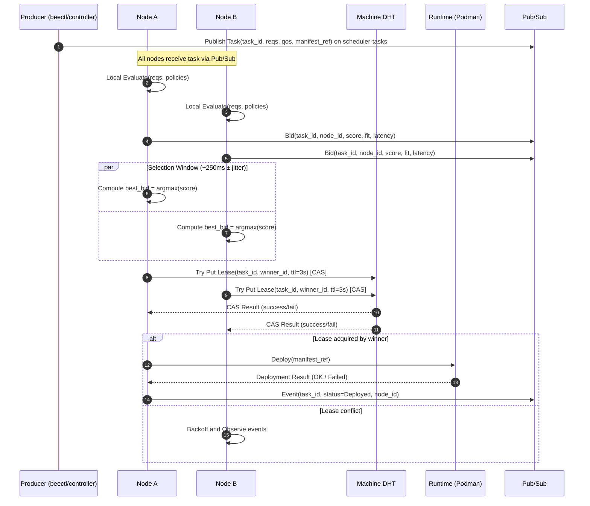
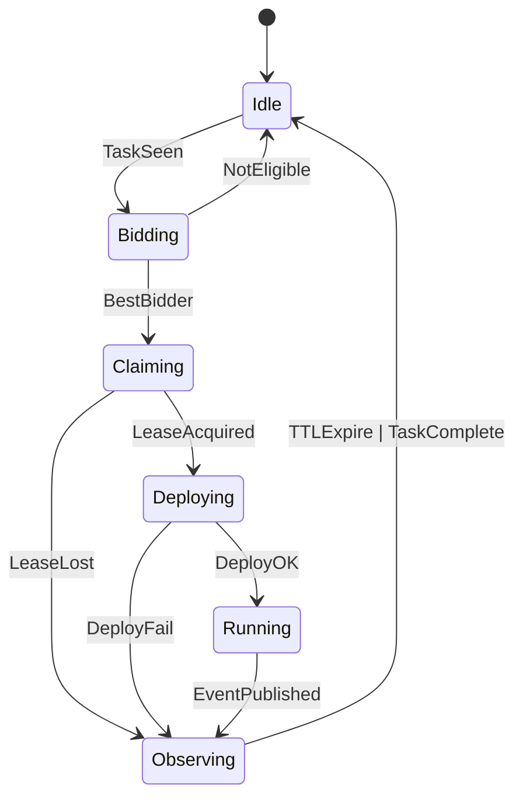
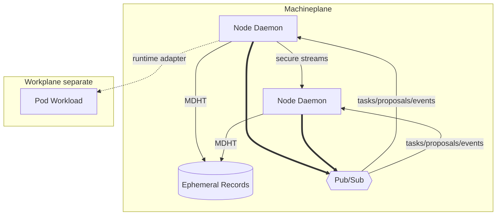

# Beemesh Machineplane — Normative Specification (v0.1)

> Scope: This document specifies the **Machineplane** of Beemesh: node discovery, scheduling, deployment, security, failure handling, and observability. It uses RFC 2119 keywords to define normative requirements and provides executable-style Gherkin scenarios.

---

## 1. Overview & Goals

The Machineplane is a **stateless, decentralized infrastructure layer** that turns machines into fungible resources. It coordinates **node discovery, ephemeral scheduling, and workload deployment** using `libp2p` primitives (DHT + Pub/Sub + secure streams). It **MUST NOT** persist cluster-wide state and **MUST** operate under Availability/Partition-Tolerance (A/P) tradeoffs.

### Non‑Goals

* Application service discovery and pod-to-pod overlay networking (**Workplane** responsibility).
* Workload state/consensus (carried by workloads themselves).

### Glossary (selected)

* **MDHT**: Machine DHT
* **Task**: A scheduling intent describing a workload to run
* **Bid**: A machine’s proposal to run a Task
* **Lease**: Short‑lived claim record for winner election

---

## 2. Architecture

### 2.1 Components

* **Machine Daemon**: single lightweight process per node (≈50–80MB RAM).
* **Machine DHT (MDHT)**: node discovery, transient metadata, and winner leases.
* **Pub/Sub Topics**:

  * `scheduler-tasks` — task publication (write-once, best‑effort fanout, gossipsub)
  * `scheduler-proposals` — bid publication, direct response / request response to the task publisher
  * `scheduler-events` — confirmations (deployed, failed, preempted)
* **Secure Streams**: bilateral encrypted channels for optional point‑to‑point negotiation.
* **Runtime Adapter**: Podman executor (default) + pluggable interface for other runtimes.

### 2.2 Data Isolation

* MDHT **MUST** store **only minimal, transient** machine metadata and leases with TTL.
* Workload DHT **MUST NOT** contain any machine-level data.

### 2.3 Diagrams







---

## 3. Protocols & Data Models

### 3.1 Identifiers

* **Machine Peer ID**: `libp2p` peer ID (base58). **MUST** be unique per machine.
* **Task ID**: ULID string. **MUST** be globally unique for de‑duplication.
* **Lease Key**: `lease/<task_id>` in MDHT.

### 3.2 Message Schemas (canonical JSON)

**Task** (published to `scheduler-tasks`):

```json
{
  "task_id": "01JABCD123...",
  "manifest_ref": "oci://registry.example/app:1.2.3#deployment.yaml",
  "reqs": { "cpu_m": 500, "mem_mb": 256, "gpu": 0, "storage_mb": 0 },
  "qos": { "priority": 5, "preemptible": true, "deadline_ms": 0 },
  "affinity": { "include": ["region:eu", "arch:amd64"], "exclude": ["zone:edge-13"] },
  "hints": { "network_locality": ["service:db-primary"], "data_locality": ["s3://bucket/key"] },
  "nonce": "base64-12B",
  "ts": 1726646400123,
  "sig": "ed25519:..."
}
```

**Bid** (published to `scheduler-proposals`):

```json
{
  "task_id": "01JABCD123...",
  "node_id": "12D3KooW...",
  "score": 0.842,
  "fit": {"cpu_m": 0.9, "mem_mb": 0.7, "latency_ms": 12},
  "reasons": ["cpu_fit", "same_region"],
  "capabilities": ["podman", "gpu:0"],
  "nonce": "base64-12B",
  "ts": 1726646400250,
  "sig": "ed25519:..."
}
```

**Event** (published to `scheduler-events`):

```json
{
  "task_id": "01JABCD123...",
  "node_id": "12D3KooW...",
  "status": "Deployed|Failed|Preempted|Cancelled",
  "details": "string",
  "ts": 1726646400450,
  "sig": "ed25519:..."
}
```

**Lease** (MDHT record, ephemeral):

```json
{
  "task_id": "01JABCD123...",
  "winner_id": "12D3KooW...",
  "expires_at": 1726646400450,
  "version": 2,
  "sig": "ed25519:..."
}
```

### 3.3 Cryptography

* All messages **MUST** be signed by the sender’s **Machine Peer ID** key (Ed25519 recommended).
* All streams **MUST** use `libp2p` TLS or Noise with mutual authentication.
* Messages **MUST** include `ts` (millisecond epoch) and **SHOULD** include `nonce` for replay mitigation.
* Receivers **MUST** reject messages with clock skew > **±30s** or a repeated `(task_id, node_id, nonce)` tuple within **5 minutes**.

---

## 4. Scheduling Algorithm (Ephemeral)

### 4.1 Flow (Normative)

1. **Publication**: A producer **MUST** publish a Task once on `scheduler-tasks`.
2. **Evaluation**: Each node **MUST** locally evaluate eligibility against `reqs`, policies, and real‑time resources.
3. **Bid Window**: Nodes **SHOULD** submit at most one Bid per Task within a **selection window** of **250ms ± 100ms jitter** from first receipt.
4. **Score**: Score **MUST** be deterministic given Task + local metrics. **SHOULD** use:

   * Resource fit (50%)
   * Network locality (30%)
   * Historical reliability (10%)
   * Price/QoS or energy (10%)
5. **Election via Lease**:

   * Nodes **MUST** compute the `best_bid` (max score; tie‑break on `(score, node_id)` lexicographic).
   * The `best_bid` node **MUST** attempt a **CAS** write of **Lease** `lease/<task_id>` with TTL **3s**.
   * First successful CAS **MUST** be accepted by all nodes as winner.
6. **Deployment**: The winner **MUST** deploy the workload via the runtime adapter.
7. **Confirmation**: The winner **MUST** publish `Event{status=Deployed|Failed}`.
8. **Lease Renewal**: Winner **MUST** renew Lease every **1s** until `Deployed` is published or timeout **(10s)**.
9. **Backoff**: Losers **MUST** observe `scheduler-events`. If no `Deployed` within Lease expiry + **1s**, they **MAY** re‑enter Claiming.

### 4.2 Resource Accounting

* Nodes **MUST** pessimistically reserve requested resources upon **LeaseAcquired** and **MUST** release on failure or after `Event{Deployed}` emission.
* Overcommit **MAY** be supported via policy; when enabled, nodes **MUST** expose overcommit ratios per resource.

### 4.3 Preemption

* Tasks marked `qos.preemptible=true` **MAY** be evicted by higher priority tasks. Evicting node **MUST** publish `Event{Preempted}` and **MUST** best‑effort re‑schedule the evicted task by republishing the original Task payload.

---

## 5. Security & Identity (Normative)

* Machine and Workload identities **MUST** be disjoint keyspaces.
* Machine-to-machine topics and streams **MUST NOT** accept Workload credentials.
* Nodes **MUST** verify message signatures and **MUST** discard unauthenticated content.
* Nodes **SHOULD** apply admission policies (allow/deny lists, org cert chains) before bidding.

---

## 6. Failure Handling

| Failure                        | Required Behavior                                                                                                                                                                                                                                 |
| ------------------------------ | ------------------------------------------------------------------------------------------------------------------------------------------------------------------------------------------------------------------------------------------------- |
| **Network Partition**          | Nodes continue local bidding and leasing. On heal, duplicate winners **MUST** reconcile via Lease version; the survivor is the holder of the **freshest valid Lease**; losers **MUST** terminate duplicate workloads and emit `Event{Cancelled}`. |
| **Winner crash before deploy** | Lease expiries trigger re‑bidding.                                                                                                                                                                                                                |
| **Late bids**                  | Ignored for current election; **MAY** be used for retry if deploy fails.                                                                                                                                                                          |
| **Conflicting Leases**         | Nodes **MUST** honor CAS semantics; the higher version with valid signature/time wins.                                                                                                                                                            |
| **Manifest fetch fail**        | Winner **MUST** emit `Event{Failed}` and **MAY** retry per local policy.                                                                                                                                                                          |

---

## 7. Runtime Adapter (Podman)

### 7.1 Contract

* **MUST** support: pull image, load manifest, create network namespace (as configured by Workplane), start container(s), stream logs, report status.
* **MUST** return a **DeploymentID** and current cgroup allocations.
* **MUST** enforce requested resource limits (cpu.shares, memory.limit\_in\_bytes, etc.).

### 7.2 Example Invocation

```
podman play kube deployment.yaml --replace --log-driver=journald
```

---

## 8. Configuration Surface (Node)

```yaml
machineplane:
  topics:
    tasks: scheduler-tasks
    proposals: scheduler-proposals
    events: scheduler-events
  selection_window_ms: 250
  selection_jitter_ms: 100
  lease_ttl_ms: 3000
  lease_renew_ms: 1000
  deploy_timeout_ms: 10000
  clock_skew_ms: 30000
  policies:
    overcommit:
      cpu: 1.2
      mem: 1.0
    affinities:
      include: ["region:eu"]
      exclude: []
  runtime: podman
  security:
    require_signed_messages: true
    accepted_cas: ["spiffe://org/ca"]
```

---

## 9. Observability

### 9.1 Events (Pub/Sub)

* **MUST** be emitted for: `Deployed`, `Failed`, `Preempted`, `Cancelled`.

### 9.2 Metrics (Prometheus‑style)

* `machineplane_tasks_seen_total{task_id}`
* `machineplane_bids_submitted_total{task_id}`
* `machineplane_lease_cas_total{result="success|fail"}`
* `machineplane_schedule_latency_ms_bucket{}` (publish → deploy)
* `machineplane_deploy_failures_total{reason}`
* `machineplane_conflict_resolutions_total{}`

### 9.3 Logs

* **SHOULD** include Task ID, Node ID, Lease version, and causal span IDs.

---

## 10. CLI Integration (`beectl`)

* `beectl create -f app.yaml` **MUST** publish a Task to `scheduler-tasks`.
* `beectl get pods` **SHOULD** read from local node/runtime and/or observe `scheduler-events` for status aggregation (best‑effort, no strong guarantees).
* `beectl delete pod <name>` **MUST** publish a cancellation Task or send a secure stream command to the owning node.

---

## 11. Interop & Compatibility

* Wire formats **MUST** be JSON with UTF‑8; unknown fields **MUST** be ignored (forward‑compat).
* Versioning **MUST** appear as top‑level field `proto_version` when incremented; nodes **MUST** expose supported versions in MDHT metadata.

---

## 12. Security Considerations

* Replay protection via `(ts, nonce)`; **MUST** reject duplicates.
* Rate limits on `scheduler-proposals`; nodes **SHOULD** cap bids/sec per peer.
* **MUST** sandbox runtime with least privilege and drop ambient capabilities not required by the manifest.

---

## 13. Gherkin Scenarios (Executable‑style)

### Feature: Node Discovery & Identity

```
Scenario: New node joins the Machine DHT
  Given a fresh machine with no persisted state
  When the daemon starts
  Then it MUST generate a unique Machine Peer ID
  And it MUST announce presence in the MDHT with a TTL record
  And other nodes SHOULD be able to discover it within 2 seconds
```

```
Scenario: Reject unsigned scheduler messages
  Given a running node subscribed to scheduler topics
  When it receives an unsigned Task
  Then it MUST discard the message
  And it MUST NOT emit a Bid
```

### Feature: Ephemeral Scheduling

```
Scenario: Single winner elected via Lease
  Given two eligible nodes A and B
  And a Task T published at time t0
  When A and B submit valid Bids within the selection window
  And A attempts CAS write of Lease(T)
  And B attempts CAS write of Lease(T)
  Then exactly one CAS MUST succeed
  And the winner MUST deploy T
  And the winner MUST publish Event{Deployed}
```

```
Scenario: Lease conflict resolution after partition
  Given a network split causing duplicate winners for T
  When the partition heals
  Then nodes MUST compare Lease versions and expires_at
  And only the freshest valid Lease holder MAY continue running T
  And the other node MUST terminate its duplicate and publish Event{Cancelled}
```

```
Scenario: Deployment timeout triggers re‑election
  Given a winner with Lease(T)
  When deployment does not complete within deploy_timeout_ms
  Then the winner MUST publish Event{Failed}
  And nodes MAY re‑enter Claiming for T after Lease expiry
```

### Feature: Preemption

```
Scenario: Higher priority Task preempts a preemptible workload
  Given a running preemptible workload Wp
  And a higher priority Task Th is published
  When a node selects Th and requires resources held by Wp
  Then the node MAY evict Wp
  And it MUST publish Event{Preempted} for Wp
  And it MUST republish Wp's original Task payload
```

### Feature: Security & Replay Protection

```
Scenario: Discard stale message beyond clock skew
  Given a node with configured clock_skew_ms = 30000
  When it receives a Task with ts older than now-30000ms
  Then it MUST discard the Task
```

---

## 14. Compliance Checklist (RFC 2119)

* [ ] Node generates unique Machine Peer ID (MUST)
* [ ] All pub/sub and stream messages are signed (MUST)
* [ ] Tasks published once; de‑duplicated by Task ID (MUST)
* [ ] Deterministic scoring and tie‑breaks (MUST)
* [ ] Lease CAS with TTL for winner election (MUST)
* [ ] Deployment confirmation events (MUST)
* [ ] Backoff and retry after lease expiry (SHOULD/MAY as specified)
* [ ] MDHT stores only transient metadata (MUST)
* [ ] Workload DHT contains no machine data (MUST)

---

## 15. Open Questions / Future Work

* Pluggable scoring weights negotiated via MDHT capabilities.
* Multi‑winner tasks (gang scheduling) and atomic co‑scheduling.
* Energy‑aware scheduling (grid carbon intensity input).
* Formal verification of election correctness under adversarial delay.

---

## 16. Change Log

* v0.1: Initial draft from project README, with normative requirements, diagrams, and Gherkin scenarios.
