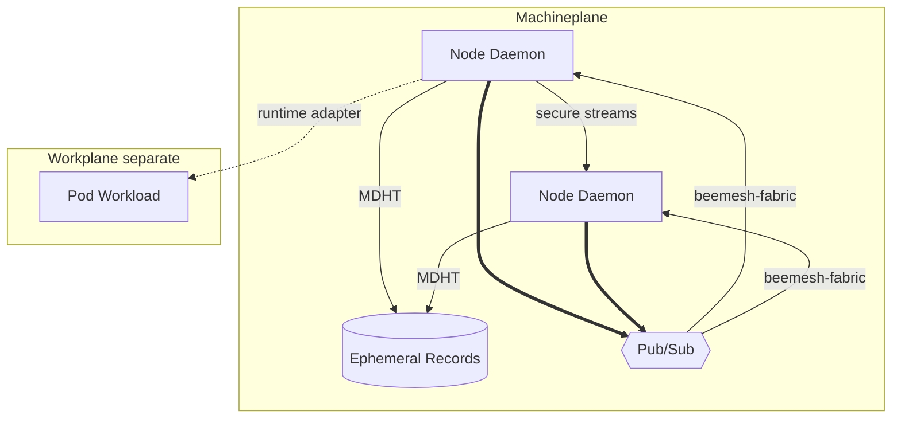

# **Beemesh Machineplane — Normative Specification (v0.2)**

> Scope: This document specifies the **Machineplane** of Beemesh: node discovery, ephemeral scheduling, deployment, security, failure handling, and observability. It uses RFC 2119 keywords and provides executable-style Gherkin scenarios.
> **Profile:** Rust implementation using `libp2p` (Kademlia DHT + Gossipsub + Noise/TLS).
> **Semantics:** Machineplane scheduling is **best-effort with deterministic winner selection (A/P)**. **Consistency for stateful workloads is guaranteed by the duplicate-tolerant Workplane (C/P).**

-----

## **1. Overview & Goals**

The Machineplane is a **stateless, decentralized infrastructure layer** that turns machines into fungible resources. It coordinates **node discovery, ephemeral scheduling, and workload deployment** using `libp2p` primitives (**DHT + Pub/Sub + secure streams**). It **MUST NOT** persist fabric-wide state and **MUST** operate under **Availability/Partition-Tolerance (A/P)** tradeoffs.

**Scheduling semantics:** Elections on the Machineplane are **hint-based**; **multiple concurrent lease hints MAY occur**. The Machineplane provides **at-least-once scheduling with deterministic winner sets**; duplicates are still tolerated by the **Workplane**, which enforces leadership and write safety for stateful workloads.

### **1.1 Non-Goals**

  * Application service discovery and pod-to-pod overlay networking (**Workplane** responsibility).
  * Workload state/consensus (carried by workloads/Workplane).

### **1.2 Glossary (selected)**

  * **MDHT**: Machine DHT (libp2p Kademlia).
  * **Tender**: Scheduling intent to run a workload.
  * **Bid**: A machine’s proposal to run a Tender.

-----

## **2. Architecture**

### **2.1 Components**

  * **Machine Daemon (Rust)**: single lightweight process per node (50–80 MiB RAM). It **MAY** be packaged and run as an OCI **container**; when containerized it **MUST**:

      * mount the host container runtime socket (e.g., Podman `/run/podman/podman.sock` or `$XDG_RUNTIME_DIR/...`),
      * provide networking suitable for libp2p inbound/outbound (host networking **RECOMMENDED**; otherwise expose ports),
      * have permissions to query/apply cgroup limits via the runtime,
      * **NOT** mount workload credentials; machine and workload identities stay disjoint.

  * **Machine DHT (MDHT)**: node discovery and transient machine metadata.

  * **Pub/Sub Topic (Gossipsub)**: `beemesh-fabric` — single shared topic used for tender publication, bid submission, awards,
    and deployment events.
      * All scheduler payloads **MUST** be bincode-encoded `SchedulerMessage` envelopes on this topic; additional scheduler topics
        are **NOT ALLOWED**.

  * **Secure Streams**: bilateral encrypted channels for optional point-to-point negotiation.

  * **Runtime Adapter**: Podman executor (default) + pluggable interface for other runtimes.

### **2.2 Data Isolation**

  * MDHT **MUST** store **only minimal, transient** machine metadata.
  * Workload DHT **MUST NOT** contain any machine-level data.

### **2.3 Diagrams**

```mermaid
sequenceDiagram
  autonumber
  participant P as Producer (kubectl/controller)
  participant N1 as Node A
  participant N2 as Node B
  participant R as Runtime (Podman)
  participant PubSub as Pub/Sub

  P->>PubSub: Publish Tender(tender_id, reqs, qos, manifest_digest)
  Note over N1,N2: All nodes receive tender via Pub/Sub (manifest stays with Producer)

  N1->>N1: Local Evaluate(reqs, policies)
  N2->>N2: Local Evaluate(reqs, policies)

  N1->>PubSub: Bid(tender_id, node_id, score, fit, latency)
  N2->>PubSub: Bid(tender_id, node_id, score, fit, latency)

  P->>P: Collect bids within window (~250ms ± jitter)
  P->>PubSub: Award(tender_id, winners)
  P-->>N1: Secure Stream: Send Manifest(ref or blob) if N1 is winner
  P-->>N2: Secure Stream: Send Manifest(ref or blob) if N2 is winner

  alt Awarded and manifest received
    N1->>R: Deploy(manifest_ref)
    R-->>N1: Deployment Result (OK / Failed)
  N1->>PubSub: Event(tender_id, status=Deployed|Failed, node_id)
  else No award observed
    N2->>N2: Backoff and observe events
  end
````

```mermaid
stateDiagram-v2
  [*] --> Idle
  Idle --> Bidding: TenderSeen
  Bidding --> Idle: NotEligible
  Bidding --> Deploying: AwardReceived & ManifestReceived
  Deploying --> Running: DeployOK
  Deploying --> Idle: DeployFail
  Running --> Idle: EventPublished | TenderComplete
```



---

## **3. Protocols & Data Models**

### **3.1 Identifiers**

* **Machine Peer ID**: `libp2p` peer ID (base58). **MUST** be unique per machine.
* **Tender ID**: ULID string. **MUST** be globally unique for de-duplication.

### **3.2 Message Schemas (libp2p-secured binary payloads)**

All inter-node communication uses **bincode-encoded Rust structs** transported over
libp2p **Noise/TLS** streams. No additional envelope or per-message encryption layer
is required because libp2p sessions are already mutually authenticated and encrypted.

**Tender (additions)**

* `workload_type`: `"stateless" | "stateful"`
* `duplicate_tolerant`: `bool` (default `true`)
* `placement_token`: ULID (monotonic per `(workload_id, attempt)`; hint for Workplane fencing)
* `manifest_digest`: content hash of the manifest **without sending the manifest itself**.
* **Replica count is not disclosed in the Tender**; the publisher decides how many bids to accept.
* **Manifest handling**: The tender owner **MUST** keep the manifest local during bidding and **MUST** only transmit a manifest reference
  or encrypted blob to awarded nodes over mutually authenticated streams after bids are validated.

**Award** (Pub/Sub broadcast)

* `tender_id`: ULID
* `winners`: ordered list of Machine Peer IDs
* `manifest_digest`: content hash matching the Tender
* `ts`: i64 (ms epoch)
* `nonce`: u64 (unique per award)
* `sig`: ed25519 signature (by tender owner)

**Existing messages** (`ApplyRequest/Response`, `CapacityRequest/Reply`) stay as in v0.1,
but are encoded directly with bincode without an envelope wrapper.

### **3.3 Cryptography**

* All messages **MUST** be signed by the sender’s **Machine Peer ID** key (Ed25519 recommended).
* All streams **MUST** use `libp2p` **Noise** or **TLS** with mutual authentication.
* Messages **MUST** include `ts` and **SHOULD** include `nonce` for replay mitigation.
* Receivers **MUST** reject messages with clock skew > **±30 s** or a repeated `(tender_id, node_id, nonce)` tuple within **5 minutes**.

---

## **4. Scheduling Algorithm (Ephemeral, Duplicate-Tolerant)**

### **4.1 Flow (Normative)**

1. **Publication**: A producer **MUST** publish a Tender once on the `beemesh-fabric` topic that includes `manifest_digest` but **MUST NOT** distribute the manifest itself during publication.

2. **Evaluation**: Each node **MUST** locally evaluate eligibility against `reqs`, policies, and real-time resources, and **MUST NOT** submit a Bid if it is ineligible.

3. **Bid Window**: Nodes **SHOULD** submit ≤ 1 Bid per Tender within **250 ms ± 100 ms** jitter from first receipt.

4. **Score**: Score **MUST** be deterministic given Tender + local metrics. **SHOULD** use: Resource fit (50%), Network locality (30%), Historical reliability (10%), Price/QoS or energy (10%).

5. **Awarding**:

   * The tender owner **MUST** collect bids for at least the bid window and **MUST** deterministically select winners using local policy plus the manifest it owns; manifest content **MUST NOT** leave the publisher until winners are chosen.
   * Winner selection **MUST** be reproducible by any observer with the same bids (for example, stable sort by score → latency → `node_id`).
   * The tender owner **SHOULD** broadcast `Award{tender_id, winners}` on `beemesh-fabric` and **MUST** send the manifest reference or encrypted blob only to the awarded nodes over a mutually authenticated stream.

6. **Manifest Transfer**:

   * The tender owner **MUST** transmit the manifest reference or encrypted blob to each awarded node over a mutually authenticated stream.
   * Recipients **MUST** verify the manifest hash matches `manifest_digest` from the Tender/Award before deploying.

7. **Deployment**:

   * An awarded node **MAY** proceed to deploy once it has the manifest from the tender owner. The **Workplane** continues to gate stateful writes/leadership.
   * The Machineplane provides **at-least-once** scheduling semantics with deterministic winner sets; duplicate deployments **MAY** still occur in partitions or retries, and correctness is enforced by the Workplane/workload logic.

8. **Confirmation**: Deployer **MUST** publish `Event{Deployed|Failed}`.

9. **Backoff**: Non-deployers **MUST** observe deployment events on `beemesh-fabric` and **SHOULD** back off with jitter; if no `Deployed` by `deploy_timeout_ms`, they **MAY** re-evaluate.

### **4.2 Resource Accounting**

* Nodes **MUST** pessimistically reserve requested resources upon deciding to deploy and **MUST** release on failure or after `Event{Deployed}` emission.
* Overcommit **MAY** be supported via policy; when enabled, nodes **MUST** expose overcommit ratios per resource.

### **4.3 Preemption**

* Tenders marked `qos.preemptible=true` **MAY** be evicted by higher priority tenders. Evicting node **MUST** publish `Event{Preempted}` and **MUST** best-effort re-schedule the evicted tender by republishing the original Tender payload.

> **Stateful note:** The **Workplane** enforces leader election and minority write refusal. Machineplane **MAY** start more than one replica transiently; Workplane **MUST** gate writes.

---

## **5. Security & Identity (Normative)**

* Machine and Workload identities **MUST** be disjoint keyspaces.
* Machine-to-machine topics and streams **MUST NOT** accept Workload credentials.
* Nodes **MUST** verify message signatures and **MUST** discard unauthenticated content.
* Nodes **SHOULD** apply admission policies (allow/deny lists, org cert chains) before bidding.

---

## **6. Failure Handling**

| Failure                             | Required Behavior                                                                                                                                                                                                                                                              |
| ----------------------------------- | ------------------------------------------------------------------------------------------------------------------------------------------------------------------------------------------------------------------------------------------------------------------------------ |
| **Network Partition**               | Nodes continue local bidding. On heal, **duplicate deployments MAY exist**. Nodes **SHOULD** prefer the deployment with freshest local health and event visibility; excess replicas **SHOULD** be drained or **MUST** respond to Workplane signals to exit. |
| **Winner crash before deploy**      | Lack of deployment events after `deploy_timeout_ms` **SHOULD** trigger backoff and potential re-award.                                                                                                                                                                                                                                  |
| **Late bids**                       | Ignored for current window; **MAY** be used for retry if deploy fails.                                                                                                                                                                                                         |
| **Conflicting Awards**          | Nodes **MUST** tolerate repeated or conflicting awards during partitions; **MUST** rely on manifest digest matching and Workplane signals to converge.                                                                                                                  |
| **Manifest fetch fail**             | Deployer **MUST** emit `Event{Failed}` and **MAY** retry per local policy.                                                                                                                                                                                                     |
| **Global bootstrap loss (paradox)** | If the Machineplane and all workloads are lost simultaneously, Beemesh alone **CANNOT** restore the fabric. An external bootstrap mechanism (for example, installers, image registries, GitOps controllers) is **REQUIRED** to repopulate the cluster.                         |

---

## **7. Runtime Adapter (Podman)**

### **7.1 Contract**

* **MUST** support: pull image, load manifest, create network namespace (as configured by Workplane), start container(s), stream logs, report status.
* **MUST** return a **DeploymentID** and current cgroup allocations.
* **MUST** enforce requested resource limits (e.g., `cpu.shares`, `memory.limit_in_bytes`).

### **7.2 Example Invocation**

```bash
podman play kube deployment.yaml --replace
```

---

## **8. Configuration Surface (Node)**

```yaml
machineplane:
  topic: beemesh-fabric
  selection_window_ms: 250
  selection_jitter_ms: 100
  deploy_timeout_ms: 10000
  clock_skew_ms: 30000
  duplicate_tolerant_default: true
  policies:
    overcommit:
      cpu: 1.2
      mem: 1.0
    affinities:
      include: ["region:eu"]
      exclude: []
  runtime: podman
  security:
    require_signed_messages: true
    accepted_cas: ["spiffe://org/ca"]
  packaging:
    run_mode: daemon|container   # either native systemd service or OCI container
```

---

## **9. Observability**

### **9.1 Events (Pub/Sub)**

* **MUST** be emitted for: `Deployed`, `Failed`, `Preempted`, `Cancelled`.

### **9.2 Logs**

* Machineplane daemons **MUST** emit logs to **stdout/stderr**. No additional log sinks or field requirements are mandated; downstream collectors **MAY** scrape stdout/stderr if desired.

---

## **10. CLI Integration (`kubectl`)**

* `kubectl create -f app.yaml` **MUST** publish a Tender to `beemesh-fabric`.
* `kubectl get pods` **SHOULD** read from local node/runtime and/or observe `beemesh-fabric` for status aggregation (best-effort).
* `kubectl delete pod <name>` **MUST** result in the Machineplane publishing a cancellation Tender or sending a secure stream command to the owning node.
* The Machineplane daemon **MUST** expose Kubernetes-compatible REST endpoints (`/version`, `/api`, `/apis/apps/v1/...`) so that the upstream `kubectl` binary can talk to it using its normal HTTP flow.

---

## **11. Interop & Compatibility**

* Wire formats **MUST** be bincode-encoded structs sent over libp2p secure channels; add new optional fields in a backward-compatible manner.
* Versioning **MUST** be tracked with explicit protocol version fields; nodes **MUST** expose supported protocol versions in MDHT metadata.

---

## **12. Security Considerations**

* Replay protection via `(ts, nonce)`; **MUST** reject duplicates.
* Rate limits on `beemesh-fabric`; nodes **SHOULD** cap bids/sec per peer.
* **MUST** sandbox runtime with least privilege and drop ambient capabilities not required by the manifest.

---

## **13. Gherkin Scenarios (Executable-style)**

### **13.1 Feature: Node Discovery & Identity**

```gherkin
Scenario: New node joins the Machine DHT
  Given a fresh machine with no persisted state
  When the Rust daemon starts
  Then it MUST generate a unique Machine Peer ID
  And it MUST announce presence in the MDHT with a TTL record
  And other nodes SHOULD be able to discover it within 2 seconds
```

```gherkin
Scenario: Reject unsigned fabric messages
  Given a running node subscribed to beemesh-fabric topic
  When it receives an unsigned Tender
  Then it MUST discard the message
  And it MUST NOT emit a Bid
```

### **13.2 Feature: Ephemeral, Duplicate-Tolerant Scheduling**

```gherkin
Scenario: At-least-once scheduling with secure manifest handoff
  Given two eligible nodes A and B
  And a Tender T published at time t0
  When A and B submit valid Bids within the selection window
  And an Award for T is published with winners including A and/or B
  And the tender owner transmits the manifest matching `manifest_digest` to the winners
  Then one or more nodes MAY proceed to deploy T
  And at least one node MUST publish Event{Deployed} if deployment succeeds
```

```gherkin
Scenario: Deterministic winner selection
  Given three eligible nodes A, B, and C
  And identical bid payloads observed by the tender owner
  When the tender owner evaluates bids with the defined scoring and tie-break rules
  Then the same ordered winner list MUST be produced on every evaluation
  And the manifest MUST be sent only to that deterministic winner set
```

```gherkin
Scenario: Partition with conflicting awards
  Given a network split causing duplicate deployments for T
  When the partition heals
  Then nodes MUST tolerate the duplicates temporarily
  And nodes SHOULD drain excess replicas
  And nodes MUST honor Workplane leader/consistency signals when present
```

```gherkin
Scenario: Deployment timeout triggers retry
  Given a node is deploying T
  When deployment does not complete within deploy_timeout_ms
  Then the node MUST publish Event{Failed}
  And nodes MAY re-evaluate T after backoff when no deployment events arrive
```

### **13.3 Feature: Preemption**

```gherkin
Scenario: Higher priority Tender preempts lower priority Tender
  Given a node running Tender L (low priority)
  And the node is fully utilized
  When a Tender H (high priority) arrives with qos.preemptible=true
  Then the node MUST evict L to make space for H
  And the node MUST publish Event{Preempted} for L
  And the node MUST republish L to the beemesh-fabric topic
```
