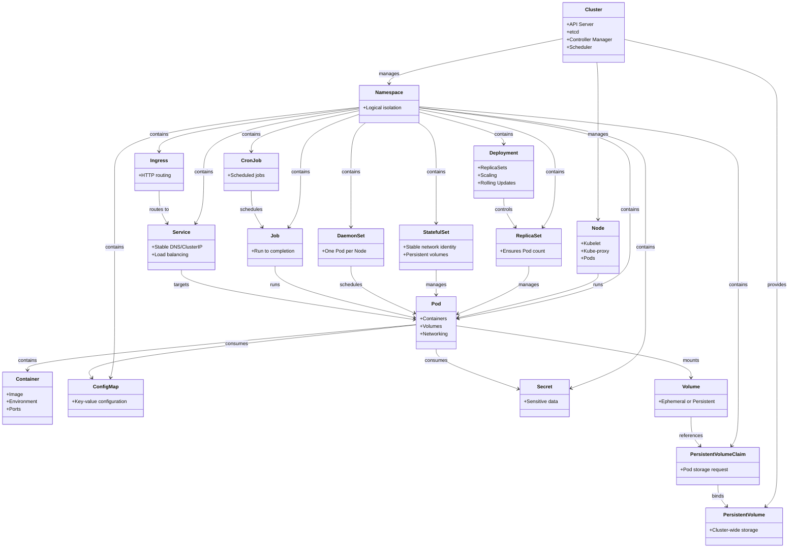

# Beemesh Technical Specification

> **Version:** 0.4.0  
> **Last Updated:** December 2025  
> **Status:** Implementation Reference

This document provides a comprehensive technical specification for the Beemesh distributed workload orchestration system, derived from the codebase and inline documentation.

---

## Table of Contents

1. [Overview](#1-overview)
2. [Architecture](#2-architecture)
3. [Machineplane](#3-machineplane)
4. [Workplane](#4-workplane)
5. [Wire Protocols](#5-wire-protocols)
6. [Security Model](#6-security-model)
7. [Data Structures](#7-data-structures)
8. [API Reference](#8-api-reference)
9. [Configuration](#9-configuration)
10. [Failure Handling](#10-failure-handling)

---

## 1. Overview

### 1.1 Purpose

Beemesh is a decentralized, scale-out workload orchestration fabric that eliminates centralized control planes. It consists of two primary components:

| Component | Purpose | CAP Trade-off |
|-----------|---------|---------------|
| **Machineplane** | Infrastructure layer: node discovery, scheduling, deployment | A/P (Availability + Partition Tolerance) |
| **Workplane** | Workload layer: service discovery, health monitoring, self-healing | C/P (Consistency + Partition Tolerance) |

### 1.2 Design Principles

1. **Statelessness**: Machineplane persists nothing; all state is derived from:
   - **Runtime state**: Podman provides the source of truth for running workloads
   - **Ephemeral tracking**: `tender_tracker` holds transient operation state (not persisted)
   - **K8s API**: All responses are reconstructed from Podman pod labels
2. **Separation of Concerns**: Machine and workload identities are cryptographically disjoint
3. **Consumer-Scoped Consistency**: Each workload manages its own consensus (Raft for stateful)
4. **Ephemeral Scheduling**: Tender→Bid→Award protocol without global state
5. **Fire-and-Forget Mutations**: CREATE/DELETE operations publish tenders and return immediately
6. **Direct Communication (v0.3)**: Only Tenders are broadcast; Bids, Awards, Events use direct request-response

### 1.3 Technology Stack

```toml
[workspace.dependencies]
libp2p = "0.56"        # Networking (QUIC, Kademlia, Gossipsub, Request-Response)
tokio = "1"            # Async runtime
serde = "1.0"          # Serialization
bincode = "1.3"        # Binary encoding for messages
axum = "0.8"           # REST API framework
sha2 = "0.10"          # SHA-256 for message digests
```

---

## 2. Architecture

### 2.1 High-Level Components

```
┌────────────────────────────────────────────────────────────────────────────┐
│                              BEEMESH FABRIC                                │
│  ┌─────────────────────────────────────────────────────────────────────┐   │
│  │                         MACHINEPLANE                                │   │
│  │                                                                     │   │
│  │  ┌──────────────┐  ┌──────────────┐  ┌──────────────┐               │   │
│  │  │  Machine A   │  │  Machine B   │  │  Machine C   │               │   │
│  │  │  (Daemon)    │◄─┤  (Daemon)    │◄─┤  (Daemon)    │               │   │
│  │  └──────┬───────┘  └──────┬───────┘  └──────┬───────┘               │   │
│  │         │                 │                 │                       │   │
│  │         └────────────┬────┴────────────┬────┘                       │   │
│  │                      │                 │                            │   │
│  │               ┌──────▼──────┐   ┌──────▼──────┐                     │   │
│  │               │    MDHT     │   │  Gossipsub  │                     │   │
│  │               │ (Kademlia)  │   │ (Pub/Sub)   │                     │   │
│  │               └─────────────┘   └─────────────┘                     │   │
│  └─────────────────────────────────────────────────────────────────────┘   │
│                                                                            │
│  ┌─────────────────────────────────────────────────────────────────────┐   │
│  │                          WORKPLANE                                  │   │
│  │                                                                     │   │
│  │  ┌──────────────┐  ┌──────────────┐  ┌──────────────┐               │   │
│  │  │  Workload A  │  │  Workload B  │  │  Workload C  │               │   │
│  │  │  (Agent)     │◄─┤  (Agent)     │◄─┤  (Agent)     │               │   │
│  │  └──────┬───────┘  └──────┬───────┘  └──────┬───────┘               │   │
│  │         │                 │                 │                       │   │
│  │         └────────────┬────┴────────────┬────┘                       │   │
│  │                      │                 │                            │   │
│  │               ┌──────▼──────┐   ┌──────▼──────┐                     │   │
│  │               │    WDHT     │   │  RPC Streams│                     │   │
│  │               │ (Kademlia)  │   │ (Req/Resp)  │                     │   │
│  │               └─────────────┘   └─────────────┘                     │   │
│  └─────────────────────────────────────────────────────────────────────┘   │
│                                                                            │
└────────────────────────────────────────────────────────────────────────────┘
```

### 2.2 Module Structure

```
beemesh/
├── machineplane/
│   ├── src/
│   │   ├── lib.rs          # Entry point, CLI config, daemon startup
│   │   ├── main.rs         # Binary entry point
│   │   ├── messages.rs     # Wire protocol message types (Tender, Bid, Award, Event, Disposal)
│   │   ├── signatures.rs   # Ed25519 signing/verification for messages
│   │   ├── runtime.rs      # Runtime integration: deployment, workload management
│   │   ├── scheduler.rs    # Tender/Bid/Award scheduling logic, disposal handling
│   │   ├── api/            # REST API (Kubernetes-compatible)
│   │   │   ├── mod.rs      # Router, tender/apply handlers, tender_tracker
│   │   │   └── kube.rs     # Stateless K8s API (derives state from Podman)
│   │   ├── network/        # libp2p networking
│   │   │   ├── mod.rs      # Swarm setup, event loop
│   │   │   ├── behaviour.rs # Gossipsub + Kademlia + Request/Response
│   │   │   ├── control.rs  # Control channel for external commands
│   │   │   └── identity.rs # Node identity and keypair management
│   │   └── runtimes/       # Container runtime adapters
│   │       ├── mod.rs      # RuntimeEngine trait, registry
│   │       ├── podman.rs   # Podman implementation
│   │       └── podman_api.rs # Podman REST API client
│   └── tests/              # Integration tests
│
└── workplane/
    ├── src/
    │   ├── lib.rs          # Crate root, module exports
    │   ├── main.rs         # Binary entry point
    │   ├── config.rs       # Agent configuration
    │   ├── agent.rs        # Main orchestrator (Agent struct)
    │   ├── network.rs      # libp2p networking (WDHT + RPC)
    │   ├── discovery.rs    # In-memory WDHT cache
    │   ├── raft.rs         # Leader election (stateful workloads)
    │   ├── selfheal.rs     # Replica management, health probing, disposal check
    │   ├── rpc.rs          # RPC request/response types
    │   └── metrics.rs      # Internal metrics macros
    └── tests/
```

---

## 3. Machineplane

### 3.1 Overview

The Machineplane daemon (`machineplane`) runs on each node and provides:

- **Node Discovery**: Kademlia DHT for peer discovery
- **Decentralized Scheduling**: Tender→Bid→Award protocol via Gossipsub
- **Workload Deployment**: Container lifecycle via Podman
- **REST API**: Kubernetes-compatible endpoints

### 3.2 Startup Sequence

```rust
pub async fn start_machineplane(cli: DaemonConfig) -> Result<Vec<JoinHandle<()>>> {
    // 1. Initialize logging
    env_logger::Builder::from_env(...).try_init();

    // 2. Configure Podman runtime socket
    let podman_socket = resolve_and_configure_podman_socket(cli.podman_socket)?;

    // 3. Generate ephemeral Ed25519 keypair (transient identity)
    let keypair = Keypair::generate_ed25519();
    let local_peer_id = keypair.public().to_peer_id();

    // 4. Set up libp2p swarm (QUIC + Gossipsub + Kademlia + Request/Response)
    let (swarm, topic, peer_rx, peer_tx) = setup_libp2p_node(...)?;

    // 5. Dial bootstrap peers
    for addr in cli.bootstrap_peer { swarm.dial(addr)?; }

    // 6. Create control channel for REST→libp2p communication
    let (control_tx, control_rx) = mpsc::unbounded_channel();

    // 7. Spawn libp2p event loop
    tokio::spawn(start_libp2p_node(swarm, topic, peer_tx, control_rx));

    // 8. Initialize runtime registry
    scheduler::initialize_podman_manager().await?;

    // 9. Start REST API server
    let app = api::build_router(peer_rx, control_tx, public_bytes);
    axum::serve(listener, app).await;
}
```

### 3.3 Scheduler Module

The scheduler implements the **Tender→Bid→Award** protocol:

```
State Machine (per tender):

[Idle] ──TenderReceived──► [Bidding] ──AwardReceived──► [Deploying] ──DeployOK──► [Running]
              │                 │                              │
              └──NotEligible──► [Idle]                         └──DeployFail──► [Idle]
```

#### 3.3.1 Message Types (v0.3)

```rust
// Tender: broadcast to all nodes via gossipsub (bincode-encoded directly)
pub struct Tender {
    pub id: String,              // ULID, globally unique
    pub manifest_digest: String, // SHA256 of manifest (content stays with owner)
    pub qos_preemptible: bool,   // Can be evicted
    pub timestamp: u64,          // ms since epoch
    pub nonce: u64,              // Replay protection
    pub signature: Vec<u8>,      // Ed25519 signature
    // Note: tender owner PeerId comes from gossipsub message.source
}

// Bid: sent directly to tender owner via request-response
pub struct Bid {
    pub tender_id: String,
    pub node_id: String,         // Machine Peer ID
    pub score: f64,              // Composite score (0.0-1.0)
    pub resource_fit_score: f64,
    pub network_locality_score: f64,
    pub timestamp: u64,
    pub nonce: u64,
    pub signature: Vec<u8>,
}

// AwardWithManifest: sent directly to each winner via request-response
// Includes manifest inline (no separate fetch required)
// Integrity is verified via signature over manifest_json
pub struct AwardWithManifest {
    pub tender_id: String,
    pub manifest_json: String,   // Full manifest content
    pub owner_peer_id: String,   // For event responses
    pub owner_pubkey: Vec<u8>,   // For authorization
    pub replicas: u32,
    pub timestamp: u64,
    pub nonce: u64,
    pub signature: Vec<u8>,      // Covers manifest_json for implicit integrity
}

// SchedulerEvent: sent directly to tender owner after deployment attempt
pub struct SchedulerEvent {
    pub tender_id: String,
    pub node_id: String,
    pub event_type: EventType,   // Deployed, Failed, Preempted, Cancelled
    pub reason: String,
    pub timestamp: u64,
    pub nonce: u64,
    pub signature: Vec<u8>,
}
```

#### 3.3.2 Message Flow (v0.3)

| Message | Transport | Protocol/Topic |
|---------|-----------|----------------|
| **Tender** | Gossipsub (broadcast) | `beemesh-fabric` topic |
| **Bid** | Request-Response (direct) | `/beemesh/bid/1.0.0` |
| **Award** | Request-Response (direct) | `/beemesh/award/1.0.0` |
| **Event** | Request-Response (direct) | `/beemesh/event/1.0.0` |

#### 3.3.3 Scheduling Flow

```rust
// Tender owner workflow (v0.3)
fn initialize_owned_tender(&self, tender_id: &str, ...) {
    // 1. Store in owned_tenders map
    // 2. Spawn async task for selection window
    tokio::spawn(async move {
        // Wait for bid collection window (~250ms ± jitter)
        sleep(Duration::from_millis(DEFAULT_SELECTION_WINDOW_MS)).await;

        // Select winners deterministically
        let winners = select_winners(&bid_context);

        // Send AwardWithManifest directly to each winner via request-response
        // Award includes manifest inline - no separate fetch required
        // Local node receives award via same path as remote nodes for consistency
        for winner in winners {
            outbound_tx.send(SchedulerCommand::SendAward {
                peer_id: winner.clone(),
                payload: award_with_manifest_bytes,
            });
        }
    });
}
```

#### 3.3.4 Replay Protection

```rust
const MAX_CLOCK_SKEW_MS: u64 = 30_000;    // ±30 seconds
const REPLAY_WINDOW_MS: u64 = 300_000;    // 5 minutes
const DISPOSAL_TTL: Duration = Duration::from_secs(300);  // 5 minutes

// Replay filter: (message_type, timestamp, nonce) tuple
fn record_replay(&mut self, key: (String, u64, u64)) -> bool {
    // Returns true if this is a new message, false if replay
    self.replay_set.insert(key)
}

fn is_timestamp_fresh(timestamp_ms: u64) -> bool {
    let now = now_ms();
    let lower = now.saturating_sub(REPLAY_WINDOW_MS);
    let upper = now.saturating_add(MAX_CLOCK_SKEW_MS);
    timestamp_ms >= lower && timestamp_ms <= upper
}
```

### 3.4 Network Module

#### 3.4.1 Behaviour Composition (v0.3)

```rust
#[derive(NetworkBehaviour)]
struct MyBehaviour {
    /// Pub/Sub for Tender broadcasts only
    gossipsub: gossipsub::Behaviour,

    /// Request-response for bid submission (bidder → tender owner)
    bid_rr: request_response::Behaviour<BidCodec>,

    /// Request-response for event reporting (winner → tender owner)
    event_rr: request_response::Behaviour<EventCodec>,

    /// Request-response for award delivery (tender owner → winner)
    award_rr: request_response::Behaviour<AwardCodec>,

    /// DHT for peer discovery and workload record storage
    kademlia: kad::Behaviour<kad::store::MemoryStore>,
}
```

#### 3.4.2 Gossipsub Configuration

```rust
let gossipsub_config = gossipsub::ConfigBuilder::default()
    .heartbeat_interval(Duration::from_secs(10))
    .validation_mode(gossipsub::ValidationMode::Strict)
    .mesh_n_low(1)           // minimum peers in mesh
    .mesh_n(3)               // target mesh size
    .mesh_n_high(6)          // maximum peers in mesh
    .mesh_outbound_min(1)    // minimum outbound connections
    .message_id_fn(content_hash_message_id)  // Content-addressed dedup
    .allow_self_origin(true)
    .build()?;

// Messages using gossipsub (beemesh/fabric topic):
// - Tender: broadcast to initiate scheduling
// - Disposal: broadcast to trigger fabric-wide deletion
// Bid, Award, Event use direct request-response protocols
```

#### 3.4.3 DHT Operations

```rust
// Periodic DHT refresh (configurable interval, default 60s)
async fn dht_refresh_tick(swarm: &mut Swarm<MyBehaviour>) {
    // Bootstrap DHT on first connection
    if !dht_bootstrapped {
        swarm.behaviour_mut().kademlia.bootstrap()?;
        dht_bootstrapped = true;
    }

    // Random walk for peer discovery
    let random_peer_id = PeerId::random();
    swarm.behaviour_mut().kademlia.get_closest_peers(random_peer_id);
}

// Store workload placement in DHT
fn publish_workload_to_dht(swarm: &mut Swarm<MyBehaviour>, workload_id: &str) {
    let record_key = kad::RecordKey::new(&format!("workload:{}", workload_id));
    let record = kad::Record {
        key: record_key,
        value: workload_id.as_bytes().to_vec(),
        publisher: None,
        expires: None,
    };
    swarm.behaviour_mut().kademlia.put_record(record, kad::Quorum::One)?;
}
```

### 3.5 Runtime Adapter

```rust
/// Runtime engine trait for container lifecycle management
#[async_trait]
pub trait RuntimeEngine: Send + Sync {
    fn name(&self) -> &str;
    async fn is_available(&self) -> bool;
    async fn apply(&self, manifest_content: &[u8], config: &DeploymentConfig) -> Result<PodInfo>;
    async fn get_status(&self, pod_id: &str) -> Result<PodInfo>;
    async fn list(&self) -> Result<Vec<PodInfo>>;
    async fn delete(&self, pod_id: &str) -> Result<()>;
    async fn logs(&self, pod_id: &str, tail: Option<usize>) -> Result<String>;
}

/// Podman implementation
impl RuntimeEngine for PodmanEngine {
    async fn apply(&self, manifest_content: &[u8], config: &DeploymentConfig) -> Result<PodInfo> {
        // 1. Write manifest to temp file
        // 2. Run: podman play kube <manifest> --replace
        // 3. Parse output for container IDs
        // 4. Return PodInfo with status
    }
}
```

#### Pod Naming Convention

Pod names are generated using **UUID v4** format to ensure uniqueness while respecting DNS hostname
limits (63 characters per RFC 1123):

```rust
/// Generate a unique pod ID using UUID v4
/// Returns a UUID v4 string (36 chars). Podman may add `-pod` suffix internally,
/// resulting in max 40 chars total—well under the 63-char DNS hostname limit.
fn generate_pod_id() -> String {
    Uuid::new_v4().to_string()
}
```

#### Pod Labels Injected During Deployment

When deploying a manifest, Beemesh injects the following labels for tracking and K8s API compatibility:

| Label | Description | Value Format |
|-------|-------------|--------------|
| `beemesh.pod_id` | Unique pod identifier | UUID v4 (36 chars) |
| `beemesh.local_peer_id` | Peer ID of the node running this pod | libp2p PeerId string |
| `beemesh.kind` | Kubernetes resource kind | "Deployment", "StatefulSet", etc. |
| `beemesh.name` | Kubernetes resource name | From manifest metadata.name |
| `io.kubernetes.pod.namespace` | K8s namespace (extracted from manifest) | Defaults to "default" |
| `app.kubernetes.io/name` | App name (extracted from manifest metadata.name) | From manifest |

### 3.6 Kubernetes API (Stateless)

The K8s API module (`kube.rs`) provides kubectl-compatible endpoints while maintaining Beemesh's
stateless architecture. **No K8s resource state is stored in memory**—all responses are derived
from the Podman runtime.

#### Architecture

```
┌─────────────────────────────────────────────────────────────────┐
│                    kubectl / K8s Client                          │
└─────────────────────────────────────────────────────────────────┘
                              │
                              ▼
┌─────────────────────────────────────────────────────────────────┐
│                    Machineplane REST API                         │
│              /apis/apps/v1/namespaces/{ns}/deployments           │
└─────────────────────────────────────────────────────────────────┘
                              │
              ┌───────────────┴───────────────┐
              │                               │
         GET/LIST                       POST/DELETE
              │                               │
              ▼                               ▼
┌─────────────────────────┐     ┌─────────────────────────┐
│   Podman Runtime        │     │   Gossipsub Tender      │
│   (local pods only)     │     │   (fire-and-forget)     │
└─────────────────────────┘     └─────────────────────────┘
```

#### Workload Aggregation

Deployments and StatefulSets are reconstructed by aggregating pods with matching labels:

```rust
// Pods with these labels are grouped into workloads:
// - app.kubernetes.io/name → workload name
// - io.kubernetes.pod.namespace → namespace filtering
// - beemesh.io/workload-kind → "Deployment" or "StatefulSet"

fn aggregate_workloads(pods: &[PodListEntry], namespace: &str, kind: Option<&str>) -> Vec<WorkloadInfo> {
    // Group pods by (namespace, kind, app_name)
    // Count replicas and ready_replicas
    // Return K8s-formatted responses
}
```

#### Limitations

| Limitation | Reason |
|------------|--------|
| Local node only | No mesh-wide aggregation; each node shows only its own pods |
| No UPDATE/PATCH | Only CREATE and DELETE supported (republish for updates) |
| Best-effort status | Status reflects Podman state, may have propagation delay |

---

## 4. Workplane

### 4.1 Overview

The Workplane agent (`workplane`) runs as a sidecar in each workload pod and provides:

- **Service Discovery**: WDHT (Workload DHT) for replica discovery
- **Health Monitoring**: HTTP liveness/readiness probes
- **Self-Healing**: Automatic scale-up/down via machineplane API
- **Leader Election**: Raft consensus for stateful workloads
- **RPC Streams**: Inter-replica communication

### 4.2 Agent Lifecycle

```rust
impl Agent {
    pub fn new(config: Config) -> Result<Self> {
        // 1. Validate required config (private_key, workload_name, pod_name)
        // 2. Initialize Network with libp2p swarm
        // 3. Register RPC stream handler
        // 4. For stateful workloads, create RaftManager
        // 5. Create SelfHealer for replica management
    }

    pub fn start(&mut self) {
        // 1. Start network (listening, bootstrap, heartbeat publishing)
        self.network.start();

        // 2. Start self-healer (health probes + reconciliation)
        if let Some(sh) = self.selfhealer.as_mut() {
            sh.start();
        }

        // 3. For stateful workloads, start LeaderMonitor (50ms tick)
        if self.is_stateful() {
            self.start_leader_monitor();
        }
    }
}
```

### 4.3 Service Discovery (WDHT)

#### 4.3.1 ServiceRecord

```rust
/// A service record published to the WDHT
#[derive(Serialize, Deserialize)]
pub struct ServiceRecord {
    pub workload_id: String,     // "{namespace}/{kind}/{workload_name}"
    pub namespace: String,
    pub workload_kind: String,
    pub workload_name: String,
    pub peer_id: String,         // libp2p PeerId
    pub pod_name: Option<String>,
    pub ordinal: Option<u32>,    // For StatefulSets
    pub addrs: Vec<String>,      // libp2p multiaddrs
    pub caps: Map<String, Value>, // Capabilities (leader, ordinal, etc.)
    pub version: u64,            // Monotonic, for conflict resolution
    pub ts: i64,                 // Unix ms timestamp
    pub nonce: String,           // UUID for uniqueness
    pub ready: bool,             // Readiness probe result
    pub healthy: bool,           // Liveness probe result
}
```

#### 4.3.2 Conflict Resolution

```rust
/// Order: version > timestamp > peer_id (lexicographic)
fn should_replace(existing: &ServiceRecord, incoming: &ServiceRecord) -> bool {
    if incoming.version > existing.version { return true; }
    if incoming.version < existing.version { return false; }
    if incoming.ts > existing.ts { return true; }
    if incoming.ts < existing.ts { return false; }
    incoming.peer_id > existing.peer_id  // Deterministic tiebreaker
}
```

#### 4.3.3 TTL-Based Expiration

```rust
const MAX_CLOCK_SKEW_MS: i64 = 30_000;  // ±30 seconds freshness check

pub fn put(record: ServiceRecord, ttl: Duration) -> bool {
    // 1. Reject stale/future timestamps
    if !is_fresh(&record) { return false; }

    // 2. Purge expired entries
    purge_expired(namespace_map);

    // 3. Conflict resolution
    if should_replace(&existing, &record) {
        // Insert with expiration time
        entries.insert(peer_id, RecordEntry {
            record,
            expires_at: Instant::now() + ttl,
        });
    }
}
```

### 4.4 Raft Consensus (Stateful Workloads)

Simplified Raft implementation for leader election only (no log replication):

```rust
/// Election timeout range (randomized to prevent split votes)
const ELECTION_TIMEOUT_MIN_MS: u64 = 150;
const ELECTION_TIMEOUT_MAX_MS: u64 = 300;

/// Heartbeat interval for leader
const HEARTBEAT_INTERVAL_MS: u64 = 50;

pub struct RaftManager {
    node_id: String,
    workload_id: String,
    term: u64,
    state: RaftState,        // Follower | Candidate | Leader
    voted_for: Option<String>,
    votes_received: HashSet<String>,
    peers: HashSet<String>,
    leader_id: Option<String>,
    last_heartbeat: Instant,
    election_timeout: Duration,  // Random 150-300ms
    last_role: RaftRole,         // For change detection
}

impl RaftManager {
    /// Bootstrap: if alone, become leader immediately
    pub fn bootstrap_if_needed(&mut self) -> Vec<RaftAction> {
        if self.peers.is_empty() && self.state != RaftState::Leader {
            self.state = RaftState::Leader;
            self.leader_id = Some(self.node_id.clone());
            self.term = 1;
            // Return LeadershipChanged action
        }
    }

    /// Periodic tick - check timeouts, send heartbeats
    pub fn tick(&mut self) -> Vec<RaftAction> {
        match self.state {
            RaftState::Leader => {
                // Send heartbeat every 50ms
                if elapsed >= Duration::from_millis(HEARTBEAT_INTERVAL_MS) {
                    actions.push(RaftAction::SendHeartbeat(...));
                }
            }
            RaftState::Follower | RaftState::Candidate => {
                // Check election timeout (150-300ms random)
                if elapsed >= self.election_timeout {
                    self.start_election(&mut actions);
                }
            }
        }
    }

    /// Handle incoming heartbeat from leader
    pub fn handle_heartbeat(&mut self, heartbeat: Heartbeat) -> Vec<RaftAction> {
        if heartbeat.term >= self.term {
            self.term = heartbeat.term;
            self.state = RaftState::Follower;
            self.leader_id = Some(heartbeat.leader_id);
            self.last_heartbeat = Instant::now();
            self.voted_for = None;  // Clear vote for next election
        }
    }
}
```

### 4.5 Self-Healing

```rust
pub struct SelfHealer {
    network: Network,
    config: Config,
    http: Client,  // For HTTP health probes
    stop_tx: Option<watch::Sender<bool>>,
    handle: Option<JoinHandle<()>>,
}

impl SelfHealer {
    pub fn start(&mut self) {
        tokio::spawn(async move {
            let mut ticker = interval(min(health_interval, replica_interval));
            loop {
                // Health probe cycle (default 10s)
                if now.duration_since(last_health) >= health_interval {
                    update_local_health(&network, &client, &cfg).await?;
                }

                // Replica reconciliation cycle (default 30s)
                if now.duration_since(last_replica) >= replica_interval {
                    reconcile_replicas(&network, &client, &cfg).await?;
                }
            }
        });
    }
}

async fn reconcile_replicas(network: &Network, client: &Client, cfg: &Config) -> Result<()> {
    // 1. Query WDHT for all workload replicas
    let records = network.find_service_peers();

    // 2. Verify health via RPC healthz calls
    let (healthy, unhealthy) = verify_health(network, &records).await;

    // 3. Check disposal status before scaling up
    if check_disposal_status(client, cfg).await? {
        // Self-terminate with SIGTERM (exit code 143)
        self_terminate(&cfg.workload_id());
    }

    // 4. Scale up if needed
    if healthy.len() < cfg.replicas {
        let deficit = cfg.replicas - healthy.len();
        for _ in 0..deficit {
            request_new_replica(cfg, client, ordinal).await?;
        }
    }

    // 5. Scale down if needed (prioritize: duplicates > unhealthy > excess healthy)
    let removal_candidates = build_removal_list(duplicates, unhealthy, excess_healthy);
    for record in removal_candidates {
        remove_replica(cfg, client, &record).await?;
    }
}
```

### 4.6 RPC Streams

```rust
/// RPC request between workload replicas
#[derive(Serialize, Deserialize)]
pub struct RPCRequest {
    pub method: String,       // "healthz", "leader", custom
    pub body: Map<String, Value>,
    pub leader_only: bool,    // Proxy to leader if true
}

#[derive(Serialize, Deserialize)]
pub struct RPCResponse {
    pub ok: bool,
    pub error: Option<String>,
    pub body: Map<String, Value>,
}

// Built-in method handlers
async fn handle_rpc(peer: &ServiceRecord, request: RPCRequest) -> RPCResponse {
    match request.method.as_str() {
        "healthz" => RPCResponse { ok: true, ..Default::default() },
        "leader" => {
            let leader_id = raft_manager.leader_id();
            RPCResponse {
                ok: true,
                body: json!({ "leader_id": leader_id }),
            }
        }
        _ if request.leader_only && !raft_manager.is_leader() => {
            // Proxy to leader
            network.send_request(&leader_id, request).await
        }
        _ => custom_handler(peer, request).await,
    }
}
```

---

## 5. Wire Protocols

### 5.1 Transport Layer

| Protocol | Port | Description |
|----------|------|-------------|
| QUIC/UDP | Dynamic | libp2p transport (encrypted, multiplexed) |
| HTTP | 3000 (default) | REST API (Kubernetes-compatible) |

### 5.2 libp2p Protocols (v0.3)

| Protocol ID | Purpose | Transport | Encoding |
|-------------|---------|-----------|----------|
| `/meshsub/1.1.0` | Gossipsub (Tender broadcast) | Pub/Sub | Bincode |
| `/beemesh/bid/1.0.0` | Bid submission | Request-Response | Bincode |
| `/beemesh/award/1.0.0` | Award delivery (with manifest) | Request-Response | Bincode |
| `/beemesh/event/1.0.0` | Event reporting | Request-Response | Bincode |
| `/ipfs/kad/1.0.0` | Kademlia DHT | DHT | Protobuf |
| `/workplane/rpc/1.0.0` | Inter-replica RPC | Request-Response | JSON |

### 5.3 Message Encoding

```rust
// All scheduler messages use bincode
fn serialize<T: Serialize>(value: &T) -> Vec<u8> {
    bincode::serialize(value).expect("serialize")
}

fn deserialize<T: for<'de> Deserialize<'de>>(bytes: &[u8]) -> bincode::Result<T> {
    bincode::deserialize(bytes)
}

// Workplane RPC uses JSON over request/response streams
async fn write_request(&mut self, io: &mut T, req: RPCRequest) -> io::Result<()> {
    let data = serde_json::to_vec(&req)?;
    io.write_all(&data).await
}
```

### 5.4 Gossipsub Topic (v0.4)

**Tender** and **Disposal** messages are broadcast via gossipsub:

```rust
const BEEMESH_FABRIC: &str = "beemesh/fabric";

// Tender: broadcast to initiate scheduling
// Disposal: broadcast to trigger fabric-wide deletion (fire-and-forget)
// Bid, Award, Event use direct request-response

// Message source identified from message.source (MessageAuthenticity::Signed)
```

### 5.5 Request-Response Protocols (v0.4)

Direct communication between specific peers:

```rust
// Bid: bidder → tender owner
// Protocol: /beemesh/bid/1.0.0
// Sent in response to receiving a Tender broadcast

// Award: tender owner → winner
// Protocol: /beemesh/award/1.0.0
// Contains AwardWithManifest (manifest included inline)

// Event: winner → tender owner
// Protocol: /beemesh/event/1.0.0
// Reports deployment success/failure (Started, Failed, HealthCheck)
```

### 5.6 Scheduler Flows

#### Deploy Flow (Tender→Bid→Award)

| Step | Message | From | To | Transport | Description |
|------|---------|------|-----|-----------|-------------|
| 1 | Tender | Requester | All nodes | Gossipsub (`beemesh/fabric`) | Broadcast manifest digest; owner PeerId from `message.source` |
| 2 | Bid | Each eligible node | Tender owner | Request-Response (`/beemesh/bid/1.0.0`) | Score + signature within selection window (~250ms) |
| 3 | Award | Tender owner | Each winner | Request-Response (`/beemesh/award/1.0.0`) | Full manifest inline (`AwardWithManifest`) |
| 4 | Event | Winner | Tender owner | Request-Response (`/beemesh/event/1.0.0`) | `Started` or `Failed` status |

#### Delete Flow (DISPOSAL)

| Step | Message | From | To | Transport | Description |
|------|---------|------|-----|-----------|-------------|
| 1 | Disposal | Requester | All nodes | Gossipsub (`beemesh/fabric`) | Fire-and-forget; namespace/kind/name + timestamp + nonce + signature |
| 2 | (local) | Each node | Podman | — | Verify signature, add to disposal_map (5m TTL), delete matching pods |

#### State Transitions

| Current State | Event | Next State | Action |
|---------------|-------|------------|--------|
| Idle | TenderReceived | Bidding | Compute score, send Bid if eligible |
| Bidding | NotEligible | Idle | Skip tender |
| Bidding | AwardReceived | Deploying | Deploy manifest via Podman |
| Deploying | DeployOK | Running | Send `Started` event |
| Deploying | DeployFail | Idle | Send `Failed` event |
| Running | DisposalReceived | Idle | Delete pods, add to disposal_map |

---

## 6. Security Model

### 6.1 Identity Separation

| Entity | Identity Type | Key Storage | Scope |
|--------|--------------|-------------|-------|
| Machine | Machine Peer ID | Ephemeral (per-run) | Infrastructure only |
| Workload | Workload Peer ID | Per-replica | Workload only |

**Critical**: Machine and workload identities are cryptographically disjoint. Machine credentials cannot access workload streams, and vice versa.

### 6.2 Message Authentication

All scheduler messages use Ed25519 signing with SHA-256 digest:

```rust
// Signature scheme:
// 1. Create "view" struct (all fields except signature)
// 2. Serialize view using deterministic bincode (little-endian, fixint)
// 3. Compute SHA-256 hash of serialized view
// 4. Sign 32-byte digest with Ed25519 private key

fn serialize_view<T: Serialize>(value: &T) -> anyhow::Result<Vec<u8>> {
    Ok(bincode::DefaultOptions::new()
        .with_little_endian()
        .with_fixint_encoding()
        .serialize(value)?)
}

pub fn sign_tender(tender: &mut Tender, keypair: &Keypair) -> Result<()> {
    let view = TenderView { /* all fields except signature */ };
    let view_bytes = serialize_view(&view)?;
    let digest: [u8; 32] = Sha256::digest(&view_bytes).into();
    tender.signature = keypair.sign(&digest)?;
    Ok(())
}

pub fn verify_sign_tender(tender: &Tender, public_key: &PublicKey) -> bool {
    let view = TenderView { /* all fields except signature */ };
    let view_bytes = match serialize_view(&view) { Ok(b) => b, Err(_) => return false };
    let digest: [u8; 32] = Sha256::digest(&view_bytes).into();
    public_key.verify(&digest, &tender.signature)
}
```

**Signed Message Types:**
- Tender, Bid, AwardWithManifest, SchedulerEvent
- Disposal
- ApplyRequest, ApplyResponse

### 6.3 Replay Protection

```rust
// Two-tier protection:
// 1. Timestamp freshness (±30s window)
// 2. (tender_id, nonce) tuple deduplication (5-minute window)

fn is_message_valid(tender: &Tender) -> bool {
    // Check timestamp freshness
    if !is_timestamp_fresh(tender.timestamp) {
        return false;
    }

    // Check replay filter
    if !mark_tender_seen(&tender.id, tender.nonce) {
        return false;  // Already seen
    }

    // Verify signature
    verify_sign_tender(tender, &public_key)
}
```

### 6.4 Transport Encryption

All libp2p connections use **Noise protocol** or **TLS** for:
- Mutual authentication (both peers verify each other)
- Encryption (all data encrypted in transit)
- Perfect forward secrecy

---

## 7. Data Structures

### 7.1 Tender (v0.3)

```rust
pub struct Tender {
    pub id: String,                   // ULID (unique, sortable)
    pub manifest_digest: String,      // SHA256 hash (base64)
    pub qos_preemptible: bool,        // Can be evicted
    pub timestamp: u64,               // ms since epoch
    pub nonce: u64,                   // Random for replay protection
    pub signature: Vec<u8>,           // Ed25519 signature
    // Note: tender owner PeerId comes from gossipsub message.source
}
```

### 7.2 Bid

```rust
pub struct Bid {
    pub tender_id: String,
    pub node_id: String,              // Machine Peer ID
    pub score: f64,                   // Composite score (0.0-1.0)
    pub resource_fit_score: f64,
    pub network_locality_score: f64,
    pub timestamp: u64,
    pub nonce: u64,
    pub signature: Vec<u8>,
}
```

### 7.3 AwardWithManifest (v0.3)

```rust
// Integrity verified via signature over manifest_json
pub struct AwardWithManifest {
    pub tender_id: String,
    pub manifest_json: String,        // Full manifest content (inline)
    pub owner_peer_id: String,        // For event responses
    pub owner_pubkey: Vec<u8>,        // For authorization
    pub replicas: u32,
    pub timestamp: u64,
    pub nonce: u64,
    pub signature: Vec<u8>,           // Covers manifest_json
}
```

### 7.4 SchedulerEvent

```rust
pub struct SchedulerEvent {
    pub tender_id: String,
    pub node_id: String,
    pub event_type: EventType,        // Started, Failed, HealthCheck
    pub reason: String,
    pub timestamp: u64,
    pub nonce: u64,
    pub signature: Vec<u8>,
}

#[derive(Copy, Clone, Serialize, Deserialize)]
pub enum EventType {
    Started,
    Failed,
    HealthCheck,
}
```

### 7.5 Disposal

```rust
/// Disposal message for workload deletion (published via Gossipsub)
///
/// Fire-and-forget message that instructs all nodes with matching resources
/// to delete their local pods. Broadcast to `beemesh-fabric` topic.
pub struct Disposal {
    pub namespace: String,            // Kubernetes namespace (e.g., "default")
    pub kind: String,                 // Resource kind (e.g., "Deployment", "Pod")
    pub name: String,                 // Resource name (from metadata.name)
    pub timestamp: u64,               // ms since UNIX epoch
    pub nonce: u64,                   // Random for replay protection
    pub signature: Vec<u8>,           // Ed25519 signature over (namespace || kind || name || timestamp || nonce)
}
```

Each node that receives a DISPOSAL:
1. Verifies signature and timestamp freshness (±30s)
2. Adds resource coordinates (`namespace/kind/name`) to `disposal_map` (5-minute TTL)
3. Deletes local pods matching the resource coordinates
4. Workplane self-healer checks disposal status before scaling up

The `disposal_map` prevents the self-healer from recovering pods that are intentionally being deleted during the TTL window.

### 7.6 ApplyRequest (REST API)

```rust
pub struct ApplyRequest {
    pub replicas: u32,
    pub operation_id: String,         // Idempotency key
    pub manifest_json: String,        // Full manifest content
    pub origin_peer: String,          // Requesting node
    pub signature: Vec<u8>,
}
```

### 7.7 ServiceRecord (WDHT)

```rust
pub struct ServiceRecord {
    pub workload_id: String,          // "{namespace}/{kind}/{workload_name}"
    pub namespace: String,
    pub workload_kind: String,
    pub workload_name: String,
    pub peer_id: String,
    pub pod_name: Option<String>,
    pub ordinal: Option<u32>,
    pub addrs: Vec<String>,
    pub caps: Map<String, Value>,
    pub version: u64,
    pub ts: i64,
    pub nonce: String,
    pub ready: bool,
    pub healthy: bool,
}
```

---

## 8. API Reference

### 8.1 Machineplane REST API

#### Kubernetes API



#### Core Endpoints

| Endpoint | Method | Description |
|----------|--------|-------------|
| `/version` | GET | API version info |
| `/apis` | GET | API group list |
| `/health` | GET | Health check |
| `/api/v1/pubkey` | GET | Get node public key |
| `/nodes` | GET | List cluster nodes |
| `/disposal/{ns}/{kind}/{name}` | GET | Check if resource is marked for disposal |
| `/disposal/{ns}/{kind}/{name}` | DELETE | Delete workload (broadcasts DISPOSAL) |

The K8s API is **stateless by design**: all read operations derive state from the local Podman runtime,
and all write operations publish tenders via Gossipsub (fire-and-forget).

| Endpoint | Method | Description | Source |
|----------|--------|-------------|--------|
| `/api/v1/namespaces/{ns}/pods` | GET | List pods | Podman runtime |
| `/api/v1/namespaces/{ns}/pods/{name}` | GET | Get pod | Podman runtime |
| `/api/v1/namespaces/{ns}/pods/{name}/log` | GET | Get pod logs | Podman runtime |
| `/apis/apps/v1/namespaces/{ns}/deployments` | GET | List deployments | Podman pods (aggregated) |
| `/apis/apps/v1/namespaces/{ns}/deployments/{name}` | GET | Get deployment | Podman pods (aggregated) |
| `/apis/apps/v1/namespaces/{ns}/deployments` | POST | Create deployment | Gossipsub tender |
| `/apis/apps/v1/namespaces/{ns}/deployments/{name}` | DELETE | Delete deployment | Gossipsub tender |
| `/apis/apps/v1/namespaces/{ns}/statefulsets` | GET | List statefulsets | Podman pods (aggregated) |
| `/apis/apps/v1/namespaces/{ns}/statefulsets/{name}` | GET | Get statefulset | Podman pods (aggregated) |
| `/apis/apps/v1/namespaces/{ns}/statefulsets` | POST | Create statefulset | Gossipsub tender |
| `/apis/apps/v1/namespaces/{ns}/statefulsets/{name}` | DELETE | Delete statefulset | Gossipsub tender |
| `/apis/apps/v1/namespaces/{ns}/replicasets` | GET | List replicasets | Derived from deployments |
| `/apis/apps/v1/namespaces/{ns}/replicasets/{name}` | GET | Get replicaset | Derived from deployments |

**Note**: K8s API responses show only workloads running on the **local node**. Mesh-wide aggregation
requires querying multiple nodes or using DHT-based discovery.

#### Tender Management

| Endpoint | Method | Description |
|----------|--------|-------------|
| `/tenders` | POST | Create tender |
| `/tenders/{tender_id}` | GET | Get tender status |
| `/tenders/{tender_id}/candidates` | POST | Get scheduling candidates |

#### Debug Endpoints

| Endpoint | Method | Description |
|----------|--------|-------------|
| `/debug/peers` | GET | List connected peers |
| `/debug/tenders` | GET | List tracked tenders |
| `/debug/local_peer_id` | GET | Get local peer ID |
| `/debug/dht/peers` | GET | List DHT peers |
| `/debug/pods` | GET | List local pods from Podman (stateless) |

### 8.2 Workplane RPC Methods

| Method | Description | Leader Only |
|--------|-------------|-------------|
| `healthz` | Health check | No |
| `leader` | Query current Raft leader | No |
| Custom | Application-defined | Configurable |

---

## 9. Configuration

### 9.1 Machineplane CLI

```rust
pub struct Cli {
    /// Host address for REST API
    #[arg(short = 'l', long, default_value = "127.0.0.1:8080")]
    pub listen: String,

    /// Podman socket path
    #[arg(short = 's', long, env = "BEEMESH_PODMAN_SOCKET")]
    pub podman_socket: Option<String>,

    /// Bootstrap peer multiaddrs
    #[arg(short = 'b', long)]
    pub bootstrap: Vec<String>,

    /// Ed25519 private key file
    #[arg(short = 'k', long, env = "BEEMESH_KEY_FILE")]
    pub key_file: Option<String>,
}
```

**Podman Socket Resolution Order:**
1. `BEEMESH_PODMAN_SOCKET` environment variable
2. `--podman-socket` CLI argument
3. `$XDG_RUNTIME_DIR/podman/podman.sock`
4. `/run/user/{uid}/podman/podman.sock`

### 9.2 Workplane Environment Variables

| Variable | Description | Default |
|----------|-------------|---------|
| `BEE_PRIVATE_KEY` | libp2p private key (base64) | **Required** |
| `BEE_WORKLOAD_NAME` | Workload name | **Required** |
| `BEE_POD_NAME` | Pod name | **Required** |
| `BEE_NAMESPACE` | Kubernetes namespace | `default` |
| `BEE_WORKLOAD_KIND` | `Deployment` or `StatefulSet` | `Deployment` |
| `BEE_REPLICAS` | Desired replica count | `1` |
| `BEE_LIVENESS_URL` | HTTP liveness probe URL | None |
| `BEE_READINESS_URL` | HTTP readiness probe URL | None |
| `BEE_BEEMESH_API` | Machineplane API URL | `http://127.0.0.1:8080` |
| `BEE_HEALTH_PROBE_INTERVAL` | Health check interval | `10s` |
| `BEE_HEALTH_PROBE_TIMEOUT` | Health check timeout | `5s` |
| `BEE_REPLICA_CHECK_INTERVAL` | Reconciliation interval | `30s` |

---

## 10. Failure Handling

### 10.1 Network Partition

| Scenario | Machineplane Behavior | Workplane Behavior |
|----------|----------------------|-------------------|
| Partial partition | Nodes continue bidding locally | WDHT records expire; replicas re-resolve |
| Full partition | No global coordination; local deploys continue | Minority partition refuses writes (Raft) |
| Partition heals | Conflicting awards tolerated; freshest wins | Raft leader re-elected; records refresh |

### 10.2 Node Failure

| Scenario | Detection | Recovery |
|----------|-----------|----------|
| Machine crash | MDHT record expires | Workplane requests new replica |
| Workplane crash | WDHT record expires | SelfHealer on other replicas requests replacement |
| Runtime crash | Container runtime monitoring | Daemon restarts container or requests replacement |

### 10.3 Deployment Failure

```rust
// Machineplane emits SchedulerEvent on deployment attempt
match process_manifest_deployment(...).await {
    Ok(pod_id) => {
        scheduler.publish_event(&tender_id, EventType::Started, "deployed successfully");
    }
    Err(e) => {
        scheduler.publish_event(&tender_id, EventType::Failed, &e.to_string());
        // Other nodes may re-evaluate tender after backoff
    }
}
```

### 10.4 Consistency Guarantees

| Workload Type | Write Consistency | Read Consistency |
|---------------|------------------|------------------|
| Stateless | None (all replicas equal) | Eventual (WDHT TTL) |
| Stateful | Leader-only (Raft quorum) | Read-your-writes (via leader) |

---

## References

- [Beemesh README](README.md) - Project overview
- [Machineplane Spec](machineplane/machineplane-spec.md) - Detailed machineplane specification
- [Workplane Spec](workplane/workplane-spec.md) - Detailed workplane specification
- [libp2p Documentation](https://docs.libp2p.io/) - Networking primitives
- [Raft Consensus Algorithm](https://raft.github.io/) - Leader election reference
