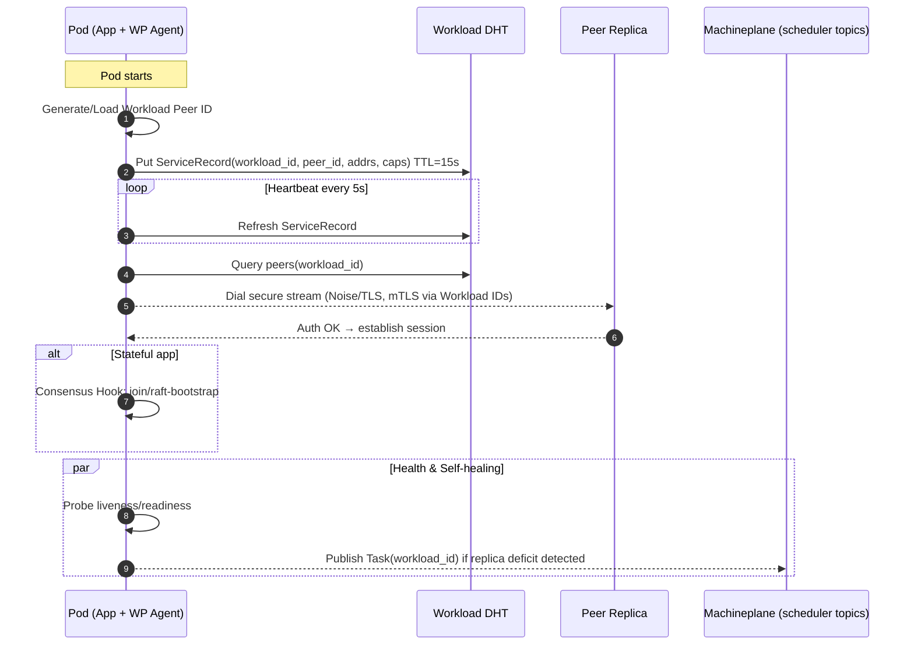
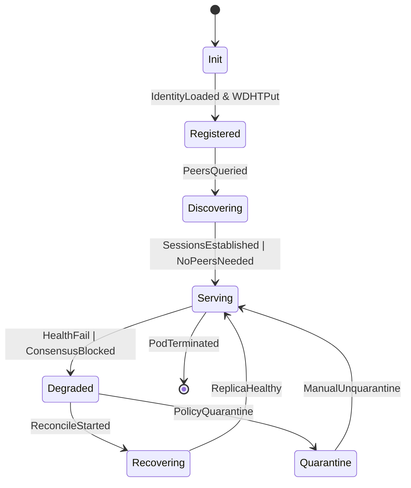
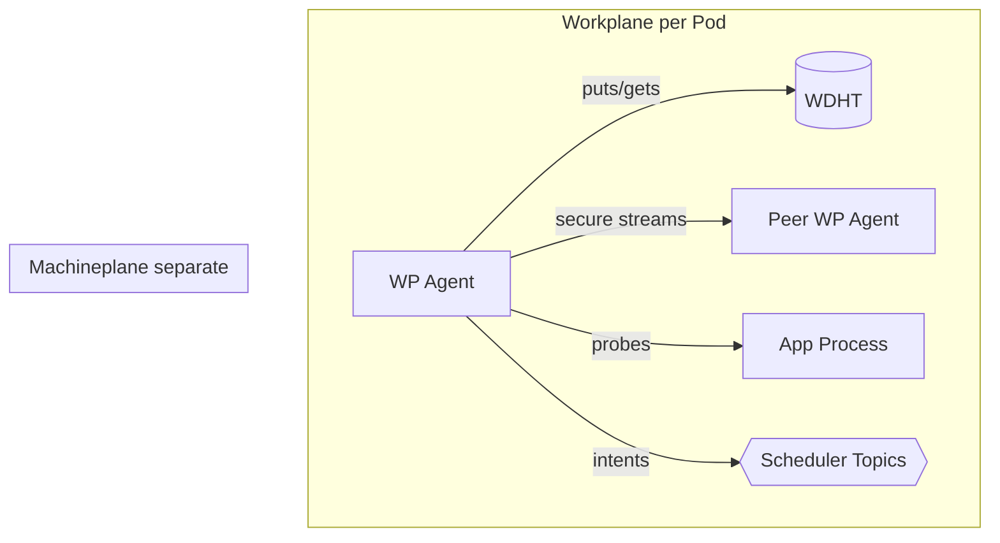

# Beemesh Workplane — Normative Specification (v0.1)

> Scope: This document specifies the **Workplane** that runs inside every workload Pod. It defines identity, service discovery, secure networking, self‑healing, workload‑scoped consensus hooks, and failure handling. It uses **RFC 2119** keywords and provides executable‑style **Gherkin** scenarios. The Workplane optimizes for **Consistency/Partition Tolerance (C/P)** and MUST remain isolated from the Machineplane trust domain.

---

## 1. Overview & Goals

The Workplane is an **in‑pod agent** that provides:

* **Per‑workload identity** and mutually authenticated encrypted streams over `libp2p`.
* **Service discovery** via a separate **Workload DHT (WDHT)**.
* **Self‑healing** replicas driven by the workload manifest.
* **Workload‑scoped consistency** for stateful apps (e.g., Raft bootstrap/join orchestration).

The Workplane **MUST NOT** rely on any centralized control plane and **MUST NOT** store machine‑level data in the WDHT. It **MUST** operate correctly under partitions by favoring **consistency** over availability where indicated by policy.

### Non‑Goals

* Node scheduling, resource accounting, or machine discovery (Machineplane responsibility).
* Cluster‑wide service registry across all machines (only workload‑scope discovery is in WDHT).

### Terms

* **WP Agent**: the process inside a Pod implementing this spec.
* **WDHT**: Workload Distributed Hash Table.
* **ServiceRecord**: discovery record for a workload replica.
* **ReplicaSet**: desired replicas for a given workload identity.

---

## 2. Architecture

### 2.1 Components

* **WP Agent** (sidecar/built‑in): handles identity, discovery, sessions, health, healing.
* **WDHT**: stores only workload‑scoped discovery and membership records with TTLs.
* **Secure Streams**: `libp2p` Noise/TLS with mutual auth using **Workload Peer IDs**.
* **Health Manager**: probes app endpoints and emits readiness/liveness.
* **Consensus Hook**: optional driver to bootstrap/join app‑level Raft (or equivalent).
* **Reconciler**: enforces desired replicas by re‑publishing **Tasks** to the Machineplane when needed (stateless intent; no durable scheduler state).

### 2.2 Isolation & Planes

* Workplane topics/streams **MUST NOT** accept Machine identities.
* Machine‑plane secrets **MUST NOT** be readable by WP Agent.

### 2.3 Diagrams







---

## 3. Identity, Crypto & Sessions

### 3.1 Workload Identity

* Each Pod **MUST** have a unique **Workload Peer ID** (Ed25519 recommended) distinct from any Machine Peer ID.
* The identity **MUST** be used exclusively for WDHT operations and workload streams.

### 3.2 Transport Security

* All workload streams **MUST** use `libp2p` **Noise** or **TLS** with mutual authentication.
* Session establishment **MUST** perform peer ID verification and **MUST** reject identity mismatches.
* Session keys **SHOULD** be re‑established (rotate) at least every **60 minutes** or after **1 GiB** of data, whichever comes first.

### 3.3 Replay & Freshness

* WDHT records and control messages **MUST** carry `ts` and optional `nonce`; receivers **MUST** reject stale entries beyond **±30s** clock skew.

---

## 4. Workload DHT (WDHT)

### 4.1 Keys & Records

* **Key**: `svc/<workload_id>/<peer_id>`
* **ServiceRecord (JSON)**:

```json
{
  "workload_id": "orders-v1",
  "peer_id": "12D3KooW...",
  "addrs": ["/ip4/10.0.1.23/tcp/4001","/dns4/orders-1/tcp/4001"],
  "caps": {"proto":["grpc","http"],"ports":{"http":8080,"raft":7000}},
  "version": 3,
  "ts": 1726646400123,
  "sig": "ed25519:..."
}
```

### 4.2 Semantics

* Records **MUST** be **append‑last‑writer‑wins** by `(version, ts, peer_id)` and have **TTL 15s** (configurable).
* WP Agents **MUST** refresh before **TTL/3** and **MUST** remove on graceful shutdown.
* WDHT **MUST NOT** store machine‑level metadata.

### 4.3 Discovery

* Clients **MUST** query `svc/<workload_id>/*` and prefer peers by locality hints (if provided by app policy). Tie‑breakers **SHOULD** use RTT and historical success rate.

---

## 5. Self‑Healing & Reconciliation

### 5.1 Desired State

* Desired replicas **MUST** be derived from the workload manifest embedded or referenced in the Pod (e.g., Deployment/StatefulSet fragment).

### 5.2 Reconciliation Loop

1. Measure **observed replicas** = distinct healthy `peer_id` under `workload_id` in WDHT.
2. If `observed < desired`, WP Agent **MUST** publish a **Task** to `scheduler-tasks` (Machineplane) that references the workload manifest to replace missing replicas.
3. If `observed > desired`, WP Agent **MAY** issue **graceful shutdown** to excess replicas selected by least healthy / newest first.
4. For StatefulSets, index ownership **MUST** be respected; WP Agent **MUST NOT** create duplicates of the same ordinal.

### 5.3 Health

* WP Agent **MUST** probe liveness/readiness endpoints defined in manifest; failing probes **MUST** downgrade the replica to **Degraded** and **MUST NOT** advertise it as ready in WDHT.

### 5.4 Preemption Awareness

* If a replica is preempted by Machineplane, remaining replicas **MUST** trigger the reconciliation loop.

---

## 6. Workload‑Scoped Consensus (Optional)

For stateful workloads:

* The first N replicas **MAY** form a Raft group (or equivalent) under app control.
* WP Agent **MUST** expose hooks to: **bootstrap**, **join**, **promote**, **demote**, and **replace** nodes.
* Under partition, minority replicas **MUST** refuse writes (read‑only mode) to preserve **consistency**.
* Membership changes **SHOULD** be serialized and guarded by application consensus.

---

## 7. Policies & Admission

* WP Agent **MUST** enforce allow/deny policies for peer workloads by workload identity (e.g., `service:db-primary`).
* Cross‑namespace communication **SHOULD** be denied by default unless explicitly allowed by policy.
* Rate‑limit inbound dials per peer (implementation defined). Excess **MUST** be dropped.

---

## 8. Observability

### 8.1 Events (Pub/Sub `workplane-events`)

* **MUST** emit: `ReplicaReady`, `ReplicaNotReady`, `ReplicaAdded`, `ReplicaRemoved`, `ReconcileStart`, `ReconcileDone`, `ConsensusEvent`.

### 8.2 Metrics (Prometheus‑style)

* `workplane_service_records{workload_id}`
* `workplane_sessions_active{workload_id}`
* `workplane_probe_latency_ms_bucket{}`
* `workplane_reconcile_cycles_total{result="scaled_up|scaled_down|noop"}`
* `workplane_consensus_role{role="leader|follower|candidate"}`

### 8.3 Logs

* **SHOULD** carry `workload_id`, `peer_id`, correlation IDs, and consensus term (if applicable).

---

## 9. Configuration (Pod‑local)

```yaml
workplane:
  wdht:
    ttl_seconds: 15
    refresh_seconds: 5
  security:
    transport: noise
    session_rotate_minutes: 60
    clock_skew_ms: 30000
    default_deny_cross_namespace: true
  health:
    liveness: { path: /healthz, interval: 5s, timeout: 1s, failureThreshold: 3 }
    readiness: { path: /ready, interval: 5s, timeout: 1s, failureThreshold: 3 }
  reconcile:
    interval: 5s
    max_parallel_repairs: 2
  consensus:
    driver: raft
    bootstrap_replicas: 3
```

---

## 10. Message Models

**ReplicaAdvert (control plane‑ish over WDHT or Pub/Sub)**

```json
{
  "workload_id": "orders-v1",
  "peer_id": "12D3KooW...",
  "ready": true,
  "endpoints": {"grpc":"/ip4/10.0.1.23/tcp/7000"},
  "role": "leader|follower|stateless",
  "ts": 1726646400450,
  "sig": "ed25519:..."
}
```

**HealIntent (to Machineplane via scheduler‑tasks)**

```json
{
  "task_id": "ULID...",
  "manifest_ref": "oci://...#deployment.yaml",
  "workload_id": "orders-v1",
  "reason": "replica_deficit",
  "nonce": "base64-12B",
  "ts": 1726646400550,
  "sig": "ed25519:..."
}
```

---

## 11. Failure Handling

| Failure                | Required Behavior                                                                                                                                                                |
| ---------------------- | -------------------------------------------------------------------------------------------------------------------------------------------------------------------------------- |
| WDHT unavailable       | WP Agent **MUST** use last known peers cache (TTL ≤ refresh\_seconds\*3) in **degraded** mode and **MUST NOT** accept new write traffic if policy requires discovery for quorum. |
| Peer identity mismatch | **MUST** terminate session and blacklist `(peer_id, addr)` for ≥ 10 minutes.                                                                                                     |
| Partition              | Minority side **MUST** refuse writes for stateful workloads; stateless may continue per policy.                                                                                  |
| App unhealthy          | **MUST** unadvertise readiness; **MAY** self‑restart if configured; **MUST** trigger reconcile if prolonged.                                                                     |
| Excess replicas        | **SHOULD** select victims using graceful drain and `ReplicaRemoved` events.                                                                                                      |

---

## 12. CLI Interactions (`beectl`)

* `beectl get pods` **SHOULD** aggregate readiness from WP Agent and WDHT presence.
* `beectl delete pod` **MUST** trigger WP Agent shutdown hook to remove ServiceRecord before exit.

---

## 13. Security Considerations

* WDHT records **MUST** be signed by the Workload Peer ID.
* WP Agent **MUST** keep keys in pod‑local secure storage and **MUST** support rotation.
* Cross‑plane credential reuse **MUST NOT** occur.

---

## 14. Gherkin Scenarios (Executable‑style)

### Feature: Workload Identity & Registration

```
Scenario: Pod registers in WDHT on startup
  Given a pod with a valid Workload Peer ID
  When the WP Agent starts
  Then it MUST publish a ServiceRecord with TTL
  And it MUST refresh the record before TTL/3 elapses
```

```
Scenario: Unsigned ServiceRecord is rejected
  Given a running WP Agent subscribed to WDHT updates
  When it receives a ServiceRecord without a valid signature
  Then it MUST ignore the record
```

### Feature: Secure Workload Sessions

```
Scenario: Mutual authentication for workload streams
  Given two replicas with distinct Workload Peer IDs
  When they dial each other over libp2p
  Then both sides MUST verify the remote Workload Peer ID
  And the session MUST be encrypted
```

### Feature: Self‑Healing

```
Scenario: Replica deficit triggers repair
  Given desired replicas = 3 for workload W
  And WDHT shows only 2 healthy ServiceRecords
  When the reconcile loop runs
  Then the WP Agent MUST publish a HealIntent Task to the Machineplane
```

```
Scenario: Excess replica triggers graceful removal
  Given desired replicas = 3 for workload W
  And WDHT shows 4 healthy ServiceRecords
  When the reconcile loop runs
  Then the WP Agent SHOULD select one replica to drain
  And it MUST unadvertise readiness before shutdown
```

### Feature: Consistency Under Partition

```
Scenario: Minority refuses writes
  Given a stateful workload with quorum size 2 of 3
  And the network partitions isolating one replica
  When client write traffic arrives at the isolated replica
  Then the replica MUST reject writes until quorum is restored
```

### Feature: Health & Readiness

```
Scenario: Probe failure removes readiness
  Given a pod reporting readiness=true
  When its readiness probe fails 3 times
  Then the WP Agent MUST set readiness=false in WDHT
```

### Feature: Key Rotation

```
Scenario: Session key rotation
  Given a long‑lived stream between two replicas
  When 60 minutes have elapsed
  Then both sides SHOULD rekey the session without dropping application traffic
```

---

## 15. Compliance Checklist (RFC 2119)

* [ ] Distinct Workload Peer ID per pod (MUST)
* [ ] WDHT records signed & TTL‑bounded (MUST)
* [ ] Secure streams with mutual auth (MUST)
* [ ] Refresh before TTL/3 (MUST)
* [ ] Reconcile loop publishes HealIntent on deficit (MUST)
* [ ] Minority refuse writes for stateful workloads (MUST)
* [ ] Cross‑namespace default deny (SHOULD)
* [ ] Session rekey policy (SHOULD)

---

## 16. Open Questions / Future Work

* Adaptive peer selection using observed latency and error rates.
* Federation across multiple WDHT rings with scoped identities.
* Pluggable consensus drivers (e.g., etcd‑compat, CRDTs for conflict‑free stateless cache).
* Traffic policies (mTLS SANs, SPIFFE integration) and service‑to‑service ACL CRDs.

---

## 17. Change Log

* v0.1: Initial Workplane spec derived from project README with normative requirements, diagrams, and Gherkin scenarios.
